springcloud学习记录

## 目录

*   [SpringCloud学习笔记1-14](#springcloud学习笔记1-14)

*   [SpringCloud学习笔记15-35](#springcloud学习笔记15-35)

*   [SpringCloud学习笔记36-46](#springcloud学习笔记36-46)

*   [SpringCloud学习笔记47-64](#springcloud学习笔记47-64)

*   [SpringCloud学习笔记65-73](#springcloud学习笔记65-73)

*   [SpringCloud学习笔记74-94](#springcloud学习笔记74-94)

*   [SpringCloud学习笔记95-137](#springcloud学习笔记95-137)

*   [1 项目地址 笔记地址](#1-项目地址-笔记地址)

*   [2 零基础微服务框架理论入门](#2-零基础微服务框架理论入门)

*   [3.Boot和Cloud版本选型](#3boot和cloud版本选型)

*   [4.Cloud组件停更说明](#4cloud组件停更说明)

*   [5.父工程Project空间新建](#5父工程project空间新建)

*   [6父工程pom文件](#6父工程pom文件)

*   [7 DependencyManagement和Dependencies](#7-dependencymanagement和dependencies)

*   [8 支付模块构建（上）](#8-支付模块构建上)

*   [9支付模块构建（中）](#9支付模块构建中)

*   [10 支付模块构建（下）](#10-支付模块构建下)

*   [11. 开启热部署](#11-开启热部署)

*   [12.消费者订单模块(上)](#12消费者订单模块上)

*   [13消费者订单模块（下）](#13消费者订单模块下)

*   [14 工程重构](#14-工程重构)

*   [15.Eureka基础知识](#15eureka基础知识)

*   [16.EurekaServer服务端安装](#16eurekaserver服务端安装)

*   [17.支付微服务8001入驻进eurekaServer](#17支付微服务8001入驻进eurekaserver)

*   [18.支付微服务80入驻EurekaServer](#18支付微服务80入驻eurekaserver)

*   [19. Eureka集群原理说明](#19-eureka集群原理说明)

*   [20. Eureka集群环境构建](#20-eureka集群环境构建)

*   [21. 订单支付两个微服务注册进Eureka集群](#21-订单支付两个微服务注册进eureka集群)

*   [22.支付微服务集群配置](#22支付微服务集群配置)

*   [23.actuator微服务信息完善](#23actuator微服务信息完善)

*   [24.服务发现Discovery](#24服务发现discovery)

*   [25.Eureka自我保护理论](#25eureka自我保护理论)

*   [26.禁用自我保护](#26禁用自我保护)

*   [27.Eureka停更](#27eureka停更)

*   [28.支付服务注册进zookeeper](#28支付服务注册进zookeeper)

*   [29.临时还是持久节点](#29临时还是持久节点)

*   [30.订单服务注册进zookeeper](#30订单服务注册进zookeeper)

*   [31-32.Consul简介、安装和运行](#31-32consul简介安装和运行)

*   [33.服务提供者注册进consul](#33服务提供者注册进consul)

*   [34.服务消费者注册进consul](#34服务消费者注册进consul)

*   [35.三个注册中心的异同点](#35三个注册中心的异同点)

*   [36.Ribbon入门](#36ribbon入门)

*   [37.Ribbon的负载均衡和Rest调用](#37ribbon的负载均衡和rest调用)

*   [38.Ribbon默认自带的负载规则](#38ribbon默认自带的负载规则)

*   [39.Ribbon负载规则替换](#39ribbon负载规则替换)

*   [40.Ribbon默认负载轮询算法原理](#40ribbon默认负载轮询算法原理)

*   [41.RoundRobinRule源码分析](#41roundrobinrule源码分析)

*   [42.Ribbon之手写轮询算法](#42ribbon之手写轮询算法)

*   [43.OpenFeign是什么](#43openfeign是什么)

*   [44.OpenFeign服务调用](#44openfeign服务调用)

*   [45.OpenFeign超时控制](#45openfeign超时控制)

*   [46.OpenFeign日志增强](#46openfeign日志增强)

*   [47.Hystrix是什么](#47hystrix是什么)

*   [48.Hystrix停更进维](#48hystrix停更进维)

*   [49.Hystrix的服务降级熔断限流概念初讲](#49hystrix的服务降级熔断限流概念初讲)

*   [50.Hystrix支付微服务构建](#50hystrix支付微服务构建)

*   [51.JMeter高并发压测后卡顿](#51jmeter高并发压测后卡顿)

*   [52.订单微服务调用支付服务出现卡顿](#52订单微服务调用支付服务出现卡顿)

*   [53.降级容错解决的维度要求](#53降级容错解决的维度要求)

*   [54.Hystrix之服务降级支付侧fallback](#54hystrix之服务降级支付侧fallback)

*   [55.Hystrix之服务降级订单侧fallback](#55hystrix之服务降级订单侧fallback)

*   [56.Hystrix之全局服务降级DefaultProperties](#56hystrix之全局服务降级defaultproperties)

*   [57.Hystrix之通配服务降级FeignFallback](#57hystrix之通配服务降级feignfallback)

*   [58.Hystrix之服务熔断理论](#58hystrix之服务熔断理论)

*   [59.Hystrix之服务熔断案例(上)](#59hystrix之服务熔断案例上)

*   [60.Hystrix之服务熔断案例(下)](#60hystrix之服务熔断案例下)

*   [61.Hystrix之服务熔断总结](#61hystrix之服务熔断总结)

*   [62.Hystrix工作流程最后总结](#62hystrix工作流程最后总结)

*   [63.Hystrix图形化Dashboard搭建](#63hystrix图形化dashboard搭建)

*   [64.Hystrix图形化Dashboard监控实战](#64hystrix图形化dashboard监控实战)

*   [65.GateWay和Zuul课程说明](#65gateway和zuul课程说明)

*   [66.GateWay是什么](#66gateway是什么)

*   [67.GateWay非阻塞异步模型](#67gateway非阻塞异步模型)

*   [68.Gateway工作流程](#68gateway工作流程)

*   [69.Gateway9527搭建](#69gateway9527搭建)

*   [70.Gateway配置路由的两种方式](#70gateway配置路由的两种方式)

*   [71.GateWay配置动态路由](#71gateway配置动态路由)

*   [72.GateWay常用的Predicate](#72gateway常用的predicate)

*   [73.GateWay的Filter](#73gateway的filter)

*   [74.Config分布式配置中心介绍](#74config分布式配置中心介绍)

*   [75.Config配置总控中心搭建（这里我用了gitee）](#75config配置总控中心搭建这里我用了gitee)

*   [76.Config客户端配置与测试](#76config客户端配置与测试)

*   [77.Config动态刷新之手动版](#77config动态刷新之手动版)

*   [78.Bus消息总线是什么](#78bus消息总线是什么)

*   [79.Bus之RabbitMQ环境配置](#79bus之rabbitmq环境配置)

*   [80.Bus动态刷新全局广播的设计思想和选型](#80bus动态刷新全局广播的设计思想和选型)

*   [81.Bus动态刷新全局广播配置实现](#81bus动态刷新全局广播配置实现)

*   [82.Bus动态刷新定点通知](#82bus动态刷新定点通知)

*   [83.Stream为什么被引入](#83stream为什么被引入)

*   [84.Stream是什么及Binder介绍](#84stream是什么及binder介绍)

*   [85.Stream的设计思想](#85stream的设计思想)

*   [86.Stream编码常用注解简介](#86stream编码常用注解简介)

*   [87.Stream消息驱动之生产者](#87stream消息驱动之生产者)

*   [88.Stream消息驱动之消费者](#88stream消息驱动之消费者)

*   [89.Stream之消息重复消费](#89stream之消息重复消费)

*   [90.Stream之group解决消息重复消费](#90stream之group解决消息重复消费)

*   [91.Stream之消息持久化](#91stream之消息持久化)

*   [92.Sleuth是什么](#92sleuth是什么)

*   [93.Sleuth之zipkin搭建安装](#93sleuth之zipkin搭建安装)

*   [94.Sleuth链路监控展现](#94sleuth链路监控展现)

*   [95.Cloud Alibaba简介](#95cloud-alibaba简介)

*   [96.Nacos简介和下载](#96nacos简介和下载)

*   [97.Nacos安装](#97nacos安装)

*   [98.Nacos之服务提供者注册](#98nacos之服务提供者注册)

*   [99.Nacos之服务消费者注册和负载](#99nacos之服务消费者注册和负载)

*   [100.Nacos服务注册中心对比提升](#100nacos服务注册中心对比提升)

*   [101.Nacos之服务配置中心](#101nacos之服务配置中心)

*   [102.Nacos之命名空间分组和DataID三者关系](#102nacos之命名空间分组和dataid三者关系)

*   [106.Nacos集群\_架构说明](#106nacos集群_架构说明)

*   [107.Nacos持久化切换配置](#107nacos持久化切换配置)

*   [108.Nacos之Linux版本安装](#108nacos之linux版本安装)

*   [109.Nacos集群配置(上)](#109nacos集群配置上)

*   [110.Nacos集群配置(下)](#110nacos集群配置下)

*   [111.Sentinel是什么](#111sentinel是什么)

*   [112.Sentinel下载安装运行](#112sentinel下载安装运行)

*   [113.Sentinel初始化监控](#113sentinel初始化监控)

*   [114-119.Sentinel流控规则简介](#114-119sentinel流控规则简介)

*   [120-123.Sentinel降级简介](#120-123sentinel降级简介)

*   [124-125.Sentinel热点key](#124-125sentinel热点key)

*   [127-136.SentinelResource配置](#127-136sentinelresource配置)

*   [137.Sentinel持久化规则](#137sentinel持久化规则)

*   [138.分布式事务问题由来](#138分布式事务问题由来)

*   [139.Seata术语](#139seata术语)

*   [140.Seata-Server安装](#140seata-server安装)

*   [141.Seata业务数据库准备](#141seata业务数据库准备)

*   [142-146.Seata之Order-Module配置搭建](#142-146seata之order-module配置搭建)

*   [147.Seata之@GlobalTransactional验证](#147seata之globaltransactional验证)

*   [148.Seata之原理简介](#148seata之原理简介)

*   [Spring Cloud组件总结](#spring-cloud组件总结)

# SpringCloud学习笔记1-14

# 1 项目地址 笔记地址

项目地址：[https://yangxiaobai.top/](https://github.com/yangxiaozhuo/springcloud "yangxiaozhuo/springcloud (github.com)")

笔记博客地址：[杨小白の博客 - Dream big and dare to fail (yangxiaobai.top/)](https://yangxiaobai.top/) 或   [杨小白の博客 - Dream big and dare to fail (yangxiaozhuo.github.io)](https://yangxiaozhuo.github.io/ "杨小白の博客 - Dream big and dare to fail (yangxiaozhuo.github.io)")

# 2 零基础微服务框架理论入门

## 2.1 什么是微服务

*   微服务是一种架构风格

*   一个应用拆分为一组小型服务

*   每个服务运行在自己的进程内，也就是可独立部署和升级

*   服务之间使用轻量级HTTP交互

*   服务围绕业务功能拆分

*   可以由全自动部署机制独立部署

*   去中心化，服务自治。服务可以使用不同的语言、不同的存储技术

## 2.2 **分布式微服务架构-落地维度**

*   服务调用

*   服务降级

*   服务注册与发先

*   服务熔断

*   负载均衡

*   服务消息队列

*   服务网关

*   配置中心管理

*   自动化构建部署

*   服务监控

*   全链路追踪

*   服务定时任务

*   调度操作

## 2.3 SpringCloud 简介

**SpringCloud=分布式微服务架构的站式解决方案，是多种微服务架构落地技术的集合体，俗称微服务全家桶**

[Spring Cloud中文网-官方文档中文版](https://www.springcloud.cc/ "Spring Cloud中文网-官方文档中文版") 包含的技术


SpringCloud主流的技术栈


技术与解决内容对应关系


# 3.Boot和Cloud版本选型

boot的版本命名用的数字，cloud用的字母表示

*   Spring Boot 2.X 版

    *   源码地址（[https://github.com/spring-projects/spring-boot/releases/](https://github.com/spring-projects/spring-boot/releases/ "https://github.com/spring-projects/spring-boot/releases/")）

*   Spring Cloud H版

    *   源码地址([https://github.com/spring-projects/spring-cloud](https://github.com/spring-projects/spring-cloud "https://github.com/spring-projects/spring-cloud"))

    *   官网（[https://spring.io/projects/spring-cloud](https://spring.io/projects/spring-cloud "https://spring.io/projects/spring-cloud")）

*   Spring Boot 与 Spring Cloud 兼容性查看


*   json接口查看（[https://start.spring.io/actuator/info](https://start.spring.io/actuator/info "https://start.spring.io/actuator/info")）

*   接下来开发用到的组件版本

    *   Cloud - **Hoxton.SR12**（22年11月最新）

    *   Boot - **2.3.12.RELEASE**（22年11月最新）

    *   Cloud - Hoxton.SR1（本项目采用）

    *   Boot - 2.2.2.RELEASE（本项目采用）

    *   Cloud Alibaba - 2.1.0.RELEASE

    *   Java - Java 8

    *   Maven - 3.5及以上

    *   MySQL - 5.7及以上

# 4.Cloud组件停更说明

*   服务注册中心

    *   × Eureka（停更不停用）

    *   √ Zookeeper ([见dubbo笔记](https://blog.yangxiaobai.top/2022/10/31/分布式/dubbo/))

    *   √ Consul

    *   √ Nacos（重点，百万级注册并发）

*   服务调用

    *   √ Ribbon

    *   √ LoadBalancer

*   服务调用2

    *   × Feign

    *   √ OpenFeign

*   服务降级

    *   × Hystrix

    *   √ resilience4j

    *   √ sentienl（重点）

*   服务网关

    *   × Zuul

    *   ! Zuul2

    *   √ gateway

*   服务配置

    *   × Config

    *   √ Nacos

*   服务总线

    *   × Bus

    *   √ Nacos

Spring Cloud中文文档（[https://www.bookstack.cn/read/spring-cloud-docs/docs-translate.md](https://www.bookstack.cn/read/spring-cloud-docs/docs-translate.md "https://www.bookstack.cn/read/spring-cloud-docs/docs-translate.md")）

# 5.父工程Project空间新建

约定>配置>编码

1.  字符编码 - Settings - File encoding

2.  注解生效激活 - Settings - Annotation Processors

3.  Java编译版本选8

4.  File Type过滤 - Settings - File Type

# 6父工程pom文件

```xml
<?xml version="1.0" encoding="UTF-8"?>
<project xmlns="http://maven.apache.org/POM/4.0.0"
         xmlns:xsi="http://www.w3.org/2001/XMLSchema-instance"
         xsi:schemaLocation="http://maven.apache.org/POM/4.0.0 http://maven.apache.org/xsd/maven-4.0.0.xsd">
    <modelVersion>4.0.0</modelVersion>

    <groupId>com.yxz.springcloud</groupId>
    <artifactId>springcloud</artifactId>
    <version>1.0-SNAPSHOT</version>
    <packaging>pom</packaging>

    <modules>
        <module>cloud-provider-payment8001</module>
    </modules>

    <!-- 统一管理jar包版本 -->
    <properties>
        <project.build.sourceEncoding>UTF-8</project.build.sourceEncoding>
        <maven.compiler.source>1.8</maven.compiler.source>
        <maven.compiler.target>1.8</maven.compiler.target>
        <junit.version>4.12</junit.version>
        <log4j.version>1.2.17</log4j.version>
        <lombok.version>1.16.18</lombok.version>
        <mysql.version>5.1.47</mysql.version>
        <druid.version>1.1.16</druid.version>
        <mybatis.spring.boot.version>1.3.0</mybatis.spring.boot.version>
    </properties>

    <!-- 子模块继承之后，提供作用：锁定版本+子modlue不用写groupId和version  -->
    <dependencyManagement>
        <dependencies>
            <!--spring boot 2.2.2-->
            <dependency>
                <groupId>org.springframework.boot</groupId>
                <artifactId>spring-boot-dependencies</artifactId>
                <version>2.2.2.RELEASE</version>
                <type>pom</type>
                <scope>import</scope>
            </dependency>
            <!--spring cloud Hoxton.SR1-->
            <dependency>
                <groupId>org.springframework.cloud</groupId>
                <artifactId>spring-cloud-dependencies</artifactId>
                <version>Hoxton.SR1</version>
                <type>pom</type>
                <scope>import</scope>
            </dependency>
            <!--spring cloud alibaba 2.1.0.RELEASE-->
            <dependency>
                <groupId>com.alibaba.cloud</groupId>
                <artifactId>spring-cloud-alibaba-dependencies</artifactId>
                <version>2.1.0.RELEASE</version>
                <type>pom</type>
                <scope>import</scope>
            </dependency>
            <dependency>
                <groupId>mysql</groupId>
                <artifactId>mysql-connector-java</artifactId>
                <version>${mysql.version}</version>
            </dependency>
            <dependency>
                <groupId>com.alibaba</groupId>
                <artifactId>druid</artifactId>
                <version>${druid.version}</version>
            </dependency>
            <dependency>
                <groupId>org.mybatis.spring.boot</groupId>
                <artifactId>mybatis-spring-boot-starter</artifactId>
                <version>${mybatis.spring.boot.version}</version>
            </dependency>
            <dependency>
                <groupId>junit</groupId>
                <artifactId>junit</artifactId>
                <version>${junit.version}</version>
            </dependency>
            <dependency>
                <groupId>log4j</groupId>
                <artifactId>log4j</artifactId>
                <version>${log4j.version}</version>
            </dependency>
            <dependency>
                <groupId>org.projectlombok</groupId>
                <artifactId>lombok</artifactId>
                <version>${lombok.version}</version>
                <optional>true</optional>
            </dependency>
        </dependencies>
    </dependencyManagement>

    <build>
        <plugins>
            <plugin>
                <groupId>org.springframework.boot</groupId>
                <artifactId>spring-boot-maven-plugin</artifactId>
                <configuration>
                    <fork>true</fork>
                    <addResources>true</addResources>
                </configuration>
            </plugin>
        </plugins>
    </build>
</project>
```

# 7 DependencyManagement和Dependencies

Maven使用`dependencyManagement`元素来提供了一种管理依赖版本号的方式。

通常会在一个组织或者项目的最顶层的父POM中看到`dependencyManagement`元素。

使用pom.xml中的`dependencyManagement`元素能让所有在子项目中引用个依赖而不用显式的列出版本量。

Maven会沿着父子层次向上走，直到找到一个拥有`dependencyManagement`元素的项目，然后它就会使用这个`dependencyManagement`元素中指定的版本号。

这样做的**好处**就是：如果有多个子项目都引用同一样依赖，则可以避免在每个使用的子项目里都声明一个版本号，这样当想升级或切换到另一个版本时，只需要在顶层父容器里更新，而不需要一个一个子项目的修改；另外如果某个子项目需要另外的一个版本，只需要声明version就可。

*   `dependencyManagement`里只是声明依赖，**并不实现引入**，因此**子项目需要显示的声明需要用的依赖**。

*   如果不在子项目中声明依赖，是不会从父项目中继承下来的；只有在子项目中写了该依赖项,并且没有指定具体版本，才会从父项目中继承该项，并且version和scope都读取自父pom。

*   如果子项目中指定了版本号，那么会使用子项目中指定的jar版本。

***

IDEA右侧旁的Maven插件有`Toggle ' Skip Tests' Mode`按钮，这样maven可以跳过单元测试

***

父工程创建完成执行`mvn : install`将父工程发布到仓库方便子工程继承。

# 8 支付模块构建（上）

创建微服务模块套路

1.  建Module

2.  改POM

3.  写YML

4.  主启动

5.  业务类

**1.建名为cloud-provider-payment8001的Maven工程**

**2.改pom文件**

```xml
<?xml version="1.0" encoding="UTF-8"?>
<project xmlns="http://maven.apache.org/POM/4.0.0"
         xmlns:xsi="http://www.w3.org/2001/XMLSchema-instance"
         xsi:schemaLocation="http://maven.apache.org/POM/4.0.0 http://maven.apache.org/xsd/maven-4.0.0.xsd">
    <parent>
        <artifactId>springcloud</artifactId>
        <groupId>com.yxz.springcloud</groupId>
        <version>1.0-SNAPSHOT</version>
    </parent>
    <modelVersion>4.0.0</modelVersion>

    <artifactId>cloud-provider-payment8001</artifactId>

    <dependencies>
        <dependency>
            <groupId>org.springframework.boot</groupId>
            <artifactId>spring-boot-starter-web</artifactId>
        </dependency>
        <dependency>
            <groupId>org.springframework.boot</groupId>
            <artifactId>spring-boot-starter-actuator</artifactId>
        </dependency>
        <dependency>
            <groupId>org.mybatis.spring.boot</groupId>
            <artifactId>mybatis-spring-boot-starter</artifactId>
        </dependency>
        <dependency>
            <groupId>com.alibaba</groupId>
            <artifactId>druid-spring-boot-starter</artifactId>
            <version>1.1.10</version>
        </dependency>
        <!--mysql-connector-java-->
        <dependency>
            <groupId>mysql</groupId>
            <artifactId>mysql-connector-java</artifactId>
        </dependency>
        <!--jdbc-->
        <dependency>
            <groupId>org.springframework.boot</groupId>
            <artifactId>spring-boot-starter-jdbc</artifactId>
        </dependency>
        <dependency>
            <groupId>org.springframework.boot</groupId>
            <artifactId>spring-boot-devtools</artifactId>
            <scope>runtime</scope>
            <optional>true</optional>
        </dependency>
        <dependency>
            <groupId>org.projectlombok</groupId>
            <artifactId>lombok</artifactId>
            <optional>true</optional>
        </dependency>
        <dependency>
            <groupId>org.springframework.boot</groupId>
            <artifactId>spring-boot-starter-test</artifactId>
            <scope>test</scope>
        </dependency>
    </dependencies>

</project>
```

**3.改yml文件**

```yaml
server:
  port: 8001

spring:
  application:
    name: cloud-payment-service
  datasource:
    type: com.alibaba.druid.pool.DruidDataSource            # 当前数据源操作类型
    driver-class-name: org.gjt.mm.mysql.Driver              # mysql驱动包 com.mysql.jdbc.Driver
    url: jdbc:mysql://localhost:3306/db2019?useUnicode=true&characterEncoding=utf-8&useSSL=false
    username: root
    password: 123456

mybatis:
  mapperLocations: classpath:mapper/*.xml
  type-aliases-package: com.atguigu.springcloud.entities    # 所有Entity别名类所在包

logging:
  level:
    com : debug

```

**4.主启动类**

```java
package com.yxz.springcloud;

import org.springframework.boot.SpringApplication;
import org.springframework.boot.autoconfigure.SpringBootApplication;

@SpringBootApplication
public class PaymentMain8001 {
    public static void main(String[] args) {
        SpringApplication.run(PaymentMain8001.class, args);
    }
}

```

# 9支付模块构建（中）

1.  建sql表&#x20;

2.  entities

3.  dao

4.  service

5.  controller

**1.sql语句**

```java
use db2019;
CREATE TABLE `payment` (
   `id` bigint(20) NOT NULL AUTO_INCREMENT COMMENT 'ID',
   `serial` varchar(200) DEFAULT '',
   PRIMARY KEY (`id`)
) ENGINE=InnoDB AUTO_INCREMENT=1 DEFAULT CHARSET=utf8

insert into payment value (31,"aaabbb01")
```

**2.CommonResult返回类**

```java
import lombok.AllArgsConstructor;
import lombok.Data;
import lombok.NoArgsConstructor;

@Data
@AllArgsConstructor
@NoArgsConstructor
public class CommonResult<T>
{
    private Integer code;
    private String  message;
    private T data;

    public CommonResult(Integer code, String message)
    {
        this(code,message,null);
    }
}

```

**实体类Payment：**

```java
import lombok.AllArgsConstructor;
import lombok.Data;
import lombok.NoArgsConstructor;

import java.io.Serializable;

@Data
@AllArgsConstructor
@NoArgsConstructor
public class Payment implements Serializable {
    private Long id;
    private String serial;
}
```

**3.PaymentDao接口**

```java
import com.yxz.springcloud.entities.Payment;
import org.apache.ibatis.annotations.Mapper;
import org.apache.ibatis.annotations.Param;

@Mapper
public interface PaymentDao {
    public int create(Payment payment);

    public Payment getPaymentById(@Param("id") Long id);
}

```

**mybatis映射文件，路径为resources/mapper/PaymentMapper.xml**

```java
<?xml version="1.0" encoding="UTF-8"?>
<!DOCTYPE mapper
        PUBLIC "-//mybatis.org//DTD Mapper 3.0//EN"
        "http://mybatis.org/dtd/mybatis-3-mapper.dtd">
<mapper namespace="com.yxz.springcloud.dao.PaymentDao">

    <resultMap id="BaseResultMap" type="com.yxz.springcloud.entities.Payment">
            <id property="id" column="id" jdbcType="BIGINT"/>
            <result property="serial" column="serial" jdbcType="VARCHAR"/>
    </resultMap>

    <sql id="Base_Column_List">
        id,serial
    </sql>

    <!--    parameterType不写全类名会爆红，但是不影响使用-->
    <insert id="create" parameterType="com.yxz.springcloud.entities.Payment" useGeneratedKeys="true" keyProperty="id" >
        insert into payment(serial) values (#{serial});
    </insert>

    <select id="getPaymentById" parameterType="Long" resultMap="BaseResultMap">
        select  * from payment where id = #{id};
    </select>

</mapper>

```

**4.Service**

PaymentService接口

```java
import com.yxz.springcloud.entities.Payment;
import org.apache.ibatis.annotations.Param;

public interface PaymentService {

    public int create(Payment payment);

    public Payment getPaymentById(@Param("id") Long id);
}

```

PaymentServiceImpl实现类

```java
import com.yxz.springcloud.dao.PaymentDao;
import com.yxz.springcloud.entities.Payment;
import com.yxz.springcloud.service.PaymentService;
import org.springframework.stereotype.Service;

import javax.annotation.Resource;

@Service
public class PaymentServiceImpl implements PaymentService {

    @Resource
    private PaymentDao paymentDao;

    @Override
    public int create(Payment payment) {
        return paymentDao.create(payment);
    }

    @Override
    public Payment getPaymentById(Long id) {
        return paymentDao.getPaymentById(id);
    }
}

```

**5.controller层** **（这里我用来restful风格）**

```java
import com.yxz.springcloud.entities.CommonResult;
import com.yxz.springcloud.entities.Payment;
import com.yxz.springcloud.service.impl.PaymentServiceImpl;
import lombok.extern.slf4j.Slf4j;
import org.springframework.web.bind.annotation.*;

import javax.annotation.Resource;


@Slf4j
@RestController
@RequestMapping("/payment")
public class PaymentController {

    @Resource
    private PaymentServiceImpl paymentService;

    @PostMapping()
    public CommonResult create(Payment payment) {
        int result = paymentService.create(payment);
        log.info("***********插入结果:" + result);
        if (result > 0) {
            return new CommonResult(200, "插入数据库成功", result);
        } else {
            return new CommonResult(444, "插入数据库失败", null);
        }
    }

    @GetMapping("/{id}")
    public CommonResult getById(@PathVariable("id") Long id) {
        Payment payment = paymentService.getPaymentById(id);
        log.info("*******查询结果" + payment);
        if (payment != null) {
            return new CommonResult(200, "查询成功", payment);
        } else {
            return new CommonResult(444, "没有ID = " + id + " 的对应记录", null);
        }
    }
}

```

# 10 支付模块构建（下）

postman测试


# 11. 开启热部署

（笔记本用户本人不建议开启）

## 1.添加依赖

```xml
<dependency>
    <groupId>org.springframework.boot</groupId>
    <artifactId>spring-boot-devtools</artifactId>
    <scope>runtime</scope>
    <optional>true</optional>
</dependency>
```

## 2.添加插件

```xml
<build>
    <!--  <finalName>你的工程名</finalName>（单一工程时添加）
    -->
    <plugins>
        <plugin>
            <groupId>org.springframework.boot</groupId>
            <artifactId>spring-boot-maven-plugin</artifactId>
            <configuration>
                <fork>true</fork>
                <addResources>true</addResources>
            </configuration>
        </plugin>
    </plugins>
</build>

```

## 3.设置

File -> Settings(New Project Settings->Settings for New Projects) ->Complier

下面项勾选

*   Automatically show first error in editor

*   Display notification on build completion

*   Build project automatically

*   Compile independent modules in parallel

键入Ctrl + Shift + Alt + / ，打开Registry，勾选：

*   compiler.automake.allow\.when.app.running

*   actionSystem.assertFocusAccessFromEdt

# 12.消费者订单模块(上)

创建微服务模块套路

1.  建Module

2.  改POM

3.  写YML

4.  主启动

5.  业务类

## 1. 建module

创建名为cloud-consumer-order80的maven工程。

## 2. 改pom

```xml
<?xml version="1.0" encoding="UTF-8"?>
<project xmlns="http://maven.apache.org/POM/4.0.0"
         xmlns:xsi="http://www.w3.org/2001/XMLSchema-instance"
         xsi:schemaLocation="http://maven.apache.org/POM/4.0.0 http://maven.apache.org/xsd/maven-4.0.0.xsd">
    <parent>
        <artifactId>springcloud</artifactId>
        <groupId>com.yxz.springcloud</groupId>
        <version>1.0-SNAPSHOT</version>
    </parent>
    <modelVersion>4.0.0</modelVersion>

    <artifactId>cloud-consumer-order80</artifactId>

    <dependencies>
        <dependency>
            <groupId>org.springframework.boot</groupId>
            <artifactId>spring-boot-starter-web</artifactId>
        </dependency>
        <dependency>
            <groupId>org.springframework.boot</groupId>
            <artifactId>spring-boot-starter-actuator</artifactId>
        </dependency>

        <dependency>
            <groupId>org.springframework.boot</groupId>
            <artifactId>spring-boot-devtools</artifactId>
            <scope>runtime</scope>
            <optional>true</optional>
        </dependency>
        <dependency>
            <groupId>org.projectlombok</groupId>
            <artifactId>lombok</artifactId>
            <optional>true</optional>
        </dependency>
        <dependency>
            <groupId>org.springframework.boot</groupId>
            <artifactId>spring-boot-starter-test</artifactId>
            <scope>test</scope>
        </dependency>
    </dependencies>
</project>
```

## 3. 写yml

```yaml
server:
  port: 80

logging:
  level:
    com : debug
```

## 4.主启动类

```java
import org.springframework.boot.SpringApplication;
import org.springframework.boot.autoconfigure.SpringBootApplication;

@SpringBootApplication
public class MainApp80 {
    public static void main(String[] args) {
        SpringApplication.run(MainApp80.class, args);
    }
}

```

## 5.业务类

### 5.1 实体类（复制payment工程的）

### 5.2controller

我这里使用了restful风格

```java
import com.yxz.springcloud.entities.CommonResult;
import com.yxz.springcloud.entities.Payment;
import lombok.extern.slf4j.Slf4j;
import org.springframework.beans.factory.annotation.Autowired;
import org.springframework.web.bind.annotation.GetMapping;
import org.springframework.web.bind.annotation.PathVariable;
import org.springframework.web.bind.annotation.RequestMapping;
import org.springframework.web.bind.annotation.RestController;
import org.springframework.web.client.RestTemplate;

@RequestMapping("/consumer/payment")
@RestController
@Slf4j
public class OrderController {

    public static final String PAYMENT_URL = "http://localhost:8001";

    @Autowired
    private RestTemplate restTemplate;

    @GetMapping("/create")
    public CommonResult<Payment> create(Payment payment) {
        return restTemplate.postForObject(PAYMENT_URL + "/payment", payment, CommonResult.class);
    }

    @GetMapping("/get/{id}")
    public CommonResult<Payment> getPayment(@PathVariable("id") Long id) {
        return restTemplate.getForObject(PAYMENT_URL + "/payment/"+id, CommonResult.class);
    }
}

```

### 5.3 配置类

```java
import org.springframework.context.annotation.Bean;
import org.springframework.context.annotation.Configuration;
import org.springframework.web.client.RestTemplate;

@Configuration
public class ApplicationConfig {

    @Bean
    public RestTemplate getRestTemplate() {
        return new RestTemplate();
    }
}

```

## 6.测试

[localhost/consumer/payment/get/31](http://localhost/consumer/payment/get/31 "localhost/consumer/payment/get/31")


[localhost/consumer/payment/create?serial=aaa](http://localhost/consumer/payment/create?serial=aaa "localhost/consumer/payment/create?serial=aaa")


# 13消费者订单模块（下）

[localhost/consumer/payment/create?serial=aaa](http://localhost/consumer/payment/create?serial=aaa "localhost/consumer/payment/create?serial=aaa")

虽然返回成功，但是观测数据库中新加了一个null的值

这是因为在在loud-provider-payment8001工程的`PaymentController`中没有添加`@RequestBody`注解。

```java
public class PaymentController {
    @PostMapping()
    public CommonResult create(/*这里*/@RequestBody Payment payment) {
        ····
    }
```

***

通过修改idea的workspace.xml的方式来快速打开Run Dashboard窗口

1.  打开工程路径下的.idea文件夹的workspace.xml

2.  在`<component name="RunDashboard">`中修改或添加以下代码

3.  重启idea

```xml
<option name="configurationTypes">
  <set>
    <option value="SpringBootApplicationConfigurationType"/>
    </set>
</option>

```

# 14 工程重构

发现cloud-consumer-order80与cloud-provider-payment8001中都有重复的entities实体类，这样我们将公共部分（包括工具类等）抽离出来作为一个新的工程，其他微服务模块在pom模块中引用即可。

**1.新建 - cloud-api-common**

**2.修改pom**

导入了hutool-all工具包

```xml
<?xml version="1.0" encoding="UTF-8"?>
<project xmlns="http://maven.apache.org/POM/4.0.0"
         xmlns:xsi="http://www.w3.org/2001/XMLSchema-instance"
         xsi:schemaLocation="http://maven.apache.org/POM/4.0.0 http://maven.apache.org/xsd/maven-4.0.0.xsd">
    <parent>
        <artifactId>springcloud</artifactId>
        <groupId>com.yxz.springcloud</groupId>
        <version>1.0-SNAPSHOT</version>
    </parent>
    <modelVersion>4.0.0</modelVersion>

    <artifactId>cloud-api-commons</artifactId>

    <dependencies>
        <dependency>
            <groupId>org.springframework.boot</groupId>
            <artifactId>spring-boot-devtools</artifactId>
            <scope>runtime</scope>
            <optional>true</optional>
        </dependency>
        <dependency>
            <groupId>org.projectlombok</groupId>
            <artifactId>lombok</artifactId>
            <optional>true</optional>
        </dependency>
        <dependency>
            <groupId>cn.hutool</groupId>
            <artifactId>hutool-all</artifactId>
            <version>5.1.0</version>
        </dependency>
    </dependencies>
</project>
```

**3.移入entities**

将cloud-consumer-order80和cloud-provider-payment8001的包移入cloud-api-commons工程下

**4.maven clean、maven install**

**5. 改造80和8001**

1.  删除entities包

2.  引入cloud-api-commons依赖

```xml
<dependency>
    <groupId>com.yxz.springcloud</groupId>
    <artifactId>cloud-api-commons</artifactId>
    <version>${project.version}</version>
</dependency>
```

**6.测试**

[localhost/consumer/payment/get/31](http://localhost/consumer/payment/get/31 "localhost/consumer/payment/get/31")

[http://localhost/consumer/payment/create?serial=bbb](http://localhost/consumer/payment/create?serial=bbb "http://localhost/consumer/payment/create?serial=bbb")

没有问题

***

到此已经学习完cloud课程的13%内容，和前四章节的内容


# 15.Eureka基础知识

*   什么是服务治理

&#x20; 在传统的rpc远程调用框架中，管理每个服务与服务之间依赖关系比较复杂，管理比较复杂，所以需要使用服务治理，管理服务于服务之间依赖关系，可以实现服务调用、负载均衡、容错等，实现服务发现与注册。

*   什么是服务注册

Eureka采用了CS的设计架构，Eureka Server 作为服务注册功能的服务器，它是服务注册中心。而系统中的其他微服务，使用 Eureka的客户端连接到 Eureka Server并维持心跳连接。这样系统的维护人员就可以通过 Eureka Server 来监控系统中各个微服务是否正常运行。
在服务注册与发现中，有一个注册中心。当服务器启动的时候，会把当前自己服务器的信息 比如 服务地址通讯地址等以别名方式注册到注册中心上。另一方（消费者|服务提供者），以该别名的方式去注册中心上获取到实际的服务通讯地址，然后再实现本地RPC调用RPC远程调用框架核心设计思想：在于注册中心，因为使用注册中心管理每个服务与服务之间的一个依赖关系(服务治理概念)。在任何rpc远程框架中，都会有一个注册中心(存放服务地址相关信息(接口地址))


*   Eureka的两个组件：Server和Client

    *   Eureka Server提供服务注册服务

    *   EurekaClient通过注册中心进行访问

# 16.EurekaServer服务端安装

1.  建module

2.  改pom

3.  写yml

4.  主启动

5.  业务类

**1.建名为cloud-eureka-server7001的module**

**2.修改pom文件**

```xml
<?xml version="1.0" encoding="UTF-8"?>
<project xmlns="http://maven.apache.org/POM/4.0.0"
         xmlns:xsi="http://www.w3.org/2001/XMLSchema-instance"
         xsi:schemaLocation="http://maven.apache.org/POM/4.0.0 http://maven.apache.org/xsd/maven-4.0.0.xsd">
    <parent>
        <artifactId>springcloud</artifactId>
        <groupId>com.yxz.springcloud</groupId>
        <version>1.0-SNAPSHOT</version>
    </parent>
    <modelVersion>4.0.0</modelVersion>

    <artifactId>cloud-eureka-server7001</artifactId>

    <dependencies>
        <!--eureka-server-->
        <dependency>
            <groupId>org.springframework.cloud</groupId>
            <artifactId>spring-cloud-starter-netflix-eureka-server</artifactId>
        </dependency>
        <!-- 引入自己定义的api通用包，可以使用Payment支付Entity -->
        <dependency>
            <groupId>com.yxz.springcloud</groupId>
            <artifactId>cloud-api-commons</artifactId>
            <version>1.0-SNAPSHOT</version>
        </dependency>
        <!--boot web actuator-->
        <dependency>
            <groupId>org.springframework.boot</groupId>
            <artifactId>spring-boot-starter-web</artifactId>
        </dependency>
        <dependency>
            <groupId>org.springframework.boot</groupId>
            <artifactId>spring-boot-starter-actuator</artifactId>
        </dependency>
        <!--一般通用配置-->
        <dependency>
            <groupId>org.springframework.boot</groupId>
            <artifactId>spring-boot-devtools</artifactId>
            <scope>runtime</scope>
            <optional>true</optional>
        </dependency>
        <dependency>
            <groupId>org.projectlombok</groupId>
            <artifactId>lombok</artifactId>
        </dependency>
        <dependency>
            <groupId>org.springframework.boot</groupId>
            <artifactId>spring-boot-starter-test</artifactId>
            <scope>test</scope>
        </dependency>
        <dependency>
            <groupId>junit</groupId>
            <artifactId>junit</artifactId>
        </dependency>
    </dependencies>
</project>
```

**3.写yml文件**

```yaml
server:
  port: 7001
eureka:
  instance:
    hostname: localhost
  client:
    #false表示不向注册中心注册自己
    register-with-eureka: false
    #false表示，自己端就是注册中心，我的职责就是去维护服务，并不需要去检索服务
    fetch-registry: false
    service-url:
      #设置与Eureka Server交互的地址查询服务和注册服务都需要依赖这个地址。
      defaultZone: http://${eureka.instance.hostname}:${server.port}/eureka/
```

**4.主启动，添加@EnableEurekaServer**

```java
import org.springframework.boot.SpringApplication;
import org.springframework.boot.autoconfigure.SpringBootApplication;
import org.springframework.cloud.netflix.eureka.server.EnableEurekaServer;

@SpringBootApplication
@EnableEurekaServer
public class EurekaMain7001 {
    public static void main(String[] args) {
        SpringApplication.run(EurekaMain7001.class, args);
    }
}

```

**5.运行**


# 17.支付微服务8001入驻进eurekaServer

1.  改module

2.  改pom

3.  写yam

4.  主启动

5.  业务类

**1.修改**​

**2.改pom**

添加eureka-client依赖

```xml
 <!--eureka-client-->
<dependency>
    <groupId>org.springframework.cloud</groupId>
    <artifactId>spring-cloud-starter-netflix-eureka-client</artifactId>
</dependency>
```

**3.写yml**

```yaml
eureka:
  client:
    #表示是否将自己注册进EurekaServer默认为true。
    register-with-eureka: true
    #是否从EurekaServer抓取已有的注册信息，默认为true。单节点无所谓，集群必须设置为true才能配合ribbon使用负载均衡
    fetch-registry: true
    service-url:
      defaultZone: http://localhost:7001/eureka
```

**4.主启动**

```java
@EnableEurekaClient  /*添加eurekaclient注解*/
@SpringBootApplication
public class PaymentMain8001 {
    public static void main(String[] args) {
        SpringApplication.run(PaymentMain8001.class, args);
    }
}
```

**5.运行**

成功注册服务


# 18.支付微服务80入驻EurekaServer

**1.改cloud-consumer-order80模块**

**2.改pom**

添加eureka-client依赖

```xml
 <!--eureka-client-->
<dependency>
    <groupId>org.springframework.cloud</groupId>
    <artifactId>spring-cloud-starter-netflix-eureka-client</artifactId>
</dependency>
```

**3.写yml**

```yaml
eureka:
  client:
    #表示是否将自己注册进EurekaServer默认为true。
    register-with-eureka: true
    #是否从EurekaServer抓取已有的注册信息，默认为true。单节点无所谓，集群必须设置为true才能配合ribbon使用负载均衡
    fetch-registry: true
    service-url:
      defaultZone: http://localhost:7001/eureka
```

**4.主启动**

```java
@EnableEurekaClient  /*添加eurekaclient注解*/
@SpringBootApplication
public class PaymentMain80 {
    public static void main(String[] args) {
        SpringApplication.run(PaymentMain80.class, args);
    }
}
```

**5.运行**

先启动cloud-eureka-server7001,后启动80和8001，通过访问80，成功调用。

# 19. Eureka集群原理说明


问题：微服务RPC远程服务调用最核心的是什么&#x20;

高可用，试想你的注册中心只有一个only one， 它出故障了那就呵呵(￣▽￣)"了，会导致整个为服务环境不可用，所以

解决办法：搭建Eureka注册中心集群 ，实现负载均衡+故障容错

**互相注册，相互守望。**

# 20. Eureka集群环境构建

创建cloud-eureka-server7002工程，参考16.EurekaServer服务端安装

*   找到C:\Windows\System32\drivers\etc路径下的hosts文件，修改映射配置添加进hosts文件

```java
#########springcloud2020########
127.0.0.1 eureka7001.com
127.0.0.1 eureka7002.com
```

*   修改cloud-eureka-server7001的yml配置文件

```yaml
server:
  port: 7001
eureka:
  instance:
    hostname: eureka7001.com
  client:
    #false表示不向注册中心注册自己
    register-with-eureka: false
    #false表示，自己端就是注册中心，我的职责就是去维护服务，并不需要去检索服务
    fetch-registry: false
    service-url:
      #设置与Eureka Server交互的地址查询服务和注册服务都需要依赖这个地址。
      defaultZone: http://eureka7002.com:7002/eureka/
```

*   修改cloud-eureka-server7002的yml配置文件

```yaml
server:
  port: 7002
eureka:
  instance:
    hostname: eureka7002.com
  client:
    #false表示不向注册中心注册自己
    register-with-eureka: false
    #false表示，自己端就是注册中心，我的职责就是去维护服务，并不需要去检索服务
    fetch-registry: false
    service-url:
      #设置与Eureka Server交互的地址查询服务和注册服务都需要依赖这个地址。
      defaultZone: http://eureka7001.com:7001/eureka/
```

# 21. 订单支付两个微服务注册进Eureka集群

*   修改8001和80的yml文件

```yaml
eureka:
  client:
    #表示是否将自己注册进Eurekaserver默认为true。
    register-with-eureka: true
    #是否从EurekaServer抓取已有的注册信息，默认为true。单节点无所谓，集群必须设置为true才能配合ribbon使用负载均衡
    fetchRegistry: true
    service-url:
      defaultZone: http://eureka7001.com:7001/eureka/,http://eureka7002.com:7002/eureka/
```

*   测试

    *   先启动7001和7002

    *   启动8001和80

    *   测试成功。

    [localhost/consumer/payment/create?serial=test](http://localhost/consumer/payment/create?serial=test "localhost/consumer/payment/create?serial=test")

    [localhost/consumer/payment/get/44](http://localhost/consumer/payment/get/44 "localhost/consumer/payment/get/44")

# 22.支付微服务集群配置

参考cloud-provider-payment8001的新建

**1.建cloud-provider-payment8002的module**

**2.改pom**

**3.写yml**

**4.主启动**

**5业务类**

修改8001/8002的Controller，添加serverPort

```java
@Value("${server.port}")
private String serverPort;

@PostMapping()
public CommonResult create(@RequestBody Payment payment) {
    int result = paymentService.create(payment);
    log.info("***********插入结果:" + result);
    if (result > 0) {
        return new CommonResult(200, "插入数据库成功, serverPort : " + serverPort, result);
    } else {
        return new CommonResult(444, "插入数据库失败, serverPort : " + serverPort, null);
    }
}

@GetMapping("/{id}")
public CommonResult getById(@PathVariable("id") Long id) {
    Payment payment = paymentService.getPaymentById(id);
    log.info("*******查询结果" + payment);
    if (payment != null) {
        return new CommonResult(200, "查询成功, serverPort : " + serverPort, payment);
    } else {
        return new CommonResult(444, "没有ID = " + id + " 的对应记录, serverPort : " + serverPort, null);
    }
}
```

**测试**

发现无法实现负载均衡，原因：80服务中的controller层把请求的端口写死了，修改为服务名称

```java
public class OrderController {

//    public static final String PAYMENT_URL = "http://localhost:8001";
    public static final String PAYMENT_URL = "http://CLOUD-PAYMENT-SERVICE";
}
```

**测试**

发现报错，这是因为没有添加负载均衡策略的注解

```java
@Configuration
public class ApplicationConfig {
    @Bean
    @LoadBalanced
    public RestTemplate getRestTemplate() {
    }
}
```

**测试**：负载均衡效果达到，8001/8002端口交替出现

# 23.actuator微服务信息完善

我们希望在eureka主页

*   显示payment8001，payment8002代替原来显示的IP地址。

*   将鼠标指针移至payment8001，payment8002名下，会有IP地址提示

修改8001和8002的yml文件

```yaml
eureka:
  instance:
    instance-id: payment8001
    prefer-ip-address: true
```

# 24.服务发现Discovery

需求：提供一个接口，供访问者查询注册进eureka里面的微服务有哪些，包括详细信息。

*   修改cloud-provider-payment8001的Controller

```java
@Slf4j
@RestController
@RequestMapping("/payment")
public class PaymentController {
    
    ···
    
    @Resource
    private DiscoveryClient discoveryClient;
    
    ···
    
    @GetMapping("/services")
    public Object discovery() {
        List<String> services = discoveryClient.getServices();
        for (String service : services) {
            log.info(service);
        }
        List<ServiceInstance> instances = discoveryClient.getInstances("CLOUD-PAYMENT-SERVICE");
        for (ServiceInstance instance : instances) {
            log.info(instance.getServiceId() + "\t" + instance.getHost() + "\t" + instance.getPort() +"\t" + instance.getUri());
        }
        return this.discoveryClient;
    }
}

```

*   8001主启动类

```java
@EnableDiscoveryClient   /*添加注解，此注解后期经常用*/
@EnableEurekaClient      /*此注解随着eureka停更后，不用eureka技术，则不再使用*/
@SpringBootApplication
public class PaymentMain8001 {
    public static void main(String[] args) {
        SpringApplication.run(PaymentMain8001.class, args);
    }
}

```

**测试**

浏览器输出


控制台打印


# 25.Eureka自我保护理论

**导致原因**

一句话：某时刻某一个微服务不可用了，Eureka不会立刻清理，依旧会对该微服务的信息进行保存。

属于CAP里面的AP分支。

*   为什么会产生Eureka自我保护机制？

为了防止EurekaClient可以正常运行，但是 与 EurekaServer网络不通情况下，EurekaServer不会立刻将EurekaClient服务剔除

*   什么是自我保护模式？

默认情况下，如果EurekaServer在一定时间内没有接收到某个微服务实例的心跳，EurekaServer将会注销该实例（默认90秒）。但是当网络分区故障发生(延时、卡顿、拥挤)时，微服务与EurekaServer之间无法正常通信，以上行为可能变得非常危险了——因为微服务本身其实是健康的，此时本不应该注销这个微服务。Eureka通过“自我保护模式”来解决这个问题——当EurekaServer节点在短时间内丢失过多客户端时（可能发生了网络分区故障），那么这个节点就会进入自我保护模式。

**简单的来说，微服务需要定时向Eureka发送消息表示自己还活着（能提供服务），但是由于某些原因，本该发送的确认消息迟迟没有到达Eureka，此时开启自我保护模式的Eureka会选择保留这个服务一段时间（默认90s），没看起自我保护的Eureka会在注册中心删除掉这个微服务**

# 26.禁用自我保护

**这里只做学习记录，我自己项目并没有设置！！**

*   在eurekaServer端7001处设置关闭自我保护机制

出厂默认，自我保护机制是开启的

使用`eureka.server.enable-self-preservation = false`可以禁用自我保护模式

```yaml
eureka:
  server:
    #关闭自我保护机制，保证不可用服务被及时踢除
    enable-self-preservation: false
    eviction-interval-timer-in-ms: 2000

```

关闭效果：

访问7001端口，Eureka会显示：**THE SELF PRESERVATION MODE IS TURNED OFF. THIS MAY NOT PROTECT INSTANCE EXPIRY IN CASE OF NETWORK/OTHER PROBLEMS.**

***

*   生产者客户端eureakeClient端8001

默认：

`eureka.instance.lease-renewal-interval-in-seconds=30`

`eureka.instance.lease-expiration-duration-in-seconds=90`

```yaml
eureka:
  instance:
    instance-id: payment8001
    prefer-ip-address: true
    #心跳检测与续约时间
    #开发时没置小些，保证服务关闭后注册中心能即使剔除服务
    #Eureka客户端向服务端发送心跳的时间间隔，单位为秒(默认是30秒)
    lease-renewal-interval-in-seconds: 1
    #Eureka服务端在收到最后一次心跳后等待时间上限，单位为秒(默认是90秒)，超时将剔除服务
    lease-expiration-duration-in-seconds: 2

```

*   测试

    *   7001和8001都配置完成

    *   先启动7001再启动8001

结果：先关闭8001，马上被删除了

# 27.Eureka停更

[https://github.com/Netflix/eureka/wiki](https://github.com/Netflix/eureka/wiki "https://github.com/Netflix/eureka/wiki")

选用zookeeper代替eureka

# 28.支付服务注册进zookeeper

zookeeper安装在虚拟机，记得启动zookeeper的服务

加入zookeeper安装目录的bin目录下，执行`./zkServer.sh start`启动服务，`./zkServer.sh status`查看状态，显示standalone即启动成功。


**1.新建cloud-consumerzk-order80**

**2.POM**

```xml
<?xml version="1.0" encoding="UTF-8"?>
<project xmlns="http://maven.apache.org/POM/4.0.0"
         xmlns:xsi="http://www.w3.org/2001/XMLSchema-instance"
         xsi:schemaLocation="http://maven.apache.org/POM/4.0.0 http://maven.apache.org/xsd/maven-4.0.0.xsd">
    <parent>
        <artifactId>springcloud</artifactId>
        <groupId>com.yxz.springcloud</groupId>
        <version>1.0-SNAPSHOT</version>
    </parent>
    <modelVersion>4.0.0</modelVersion>

    <artifactId>cloud-provider-payment8004</artifactId>

    <dependencies>
        <!-- SpringBoot整合Web组件 -->
        <dependency>
            <groupId>org.springframework.boot</groupId>
            <artifactId>spring-boot-starter-web</artifactId>
        </dependency>
        <dependency><!-- 引入自己定义的api通用包，可以使用Payment支付Entity -->
            <groupId>com.yxz.springcloud</groupId>
            <artifactId>cloud-api-commons</artifactId>
            <version>${project.version}</version>
        </dependency>
        <!-- SpringBoot整合zookeeper客户端 -->
        <dependency>
            <groupId>org.springframework.cloud</groupId>
            <artifactId>spring-cloud-starter-zookeeper-discovery</artifactId>
        </dependency>
        <dependency>
            <groupId>org.springframework.boot</groupId>
            <artifactId>spring-boot-devtools</artifactId>
            <scope>runtime</scope>
            <optional>true</optional>
        </dependency>
        <dependency>
            <groupId>org.projectlombok</groupId>
            <artifactId>lombok</artifactId>
            <optional>true</optional>
        </dependency>
        <dependency>
            <groupId>org.springframework.boot</groupId>
            <artifactId>spring-boot-starter-test</artifactId>
            <scope>test</scope>
        </dependency>
    </dependencies>

</project>
```

**3.yml**

```yaml
#8004表示注册到zookeeper服务器的支付服务提供者端口号
server:
  port: 8004
#服务别名----注册zookeeper到注册中心名称
spring:
  application:
    name: cloud-provider-payment
  cloud:
    zookeeper:
      connect-string: 192.168.20.128:2181
```

**4.主启动**

```java
@SpringBootApplication
@EnableDiscoveryClient   //该注解用于向使用consul或者zookeeper作为注册中心时注册服务
public class PaymentMain8004 {
    public static void main(String[] args) {
        SpringApplication.run(PaymentMain8004.class, args);
    }
}

```

**5.业务类**

controller

```java
@RestController
@RequestMapping("/payment")
public class PaymentController {
    @Value("${server.port}")
    private String serverPort;

    @RequestMapping(value = "/zk")
    public String paymentzk()
    {
        return "springcloud with zookeeper: "+serverPort+"\t"+ UUID.randomUUID().toString();
    }
}

```

**6.测试**

启动zookeeper客户端。

请求超时的检查一下yml中的ip有没有改

发现报错，愿意是zookeeper版本号冲突，导入新的pom。如果本机zookeeper版本高，有可能不会报错。

```xml
<?xml version="1.0" encoding="UTF-8"?>
<project xmlns="http://maven.apache.org/POM/4.0.0"
         xmlns:xsi="http://www.w3.org/2001/XMLSchema-instance"
         xsi:schemaLocation="http://maven.apache.org/POM/4.0.0 http://maven.apache.org/xsd/maven-4.0.0.xsd">
    <parent>
        <artifactId>springcloud</artifactId>
        <groupId>com.yxz.springcloud</groupId>
        <version>1.0-SNAPSHOT</version>
    </parent>
    <modelVersion>4.0.0</modelVersion>

    <artifactId>cloud-provider-payment8004</artifactId>

    <dependencies>
        <!-- SpringBoot整合Web组件 -->
        <dependency>
            <groupId>org.springframework.boot</groupId>
            <artifactId>spring-boot-starter-web</artifactId>
        </dependency>
        <dependency><!-- 引入自己定义的api通用包，可以使用Payment支付Entity -->
            <groupId>com.yxz.springcloud</groupId>
            <artifactId>cloud-api-commons</artifactId>
            <version>${project.version}</version>
        </dependency>
        <!-- SpringBoot整合zookeeper客户端 -->
        <dependency>
            <groupId>org.springframework.cloud</groupId>
            <artifactId>spring-cloud-starter-zookeeper-discovery</artifactId>
            <!--先排除自带的zookeeper3.5.3-->
            <exclusions>
                <exclusion>
                    <groupId>org.apache.zookeeper</groupId>
                    <artifactId>zookeeper</artifactId>
                </exclusion>
            </exclusions>
        </dependency>
        <!--添加zookeeper3.4.9版本-->
        <dependency>
            <groupId>org.apache.zookeeper</groupId>
            <artifactId>zookeeper</artifactId>
            <version>3.4.9</version>
        </dependency>
        <dependency>
            <groupId>org.springframework.boot</groupId>
            <artifactId>spring-boot-devtools</artifactId>
            <scope>runtime</scope>
            <optional>true</optional>
        </dependency>
        <dependency>
            <groupId>org.projectlombok</groupId>
            <artifactId>lombok</artifactId>
            <optional>true</optional>
        </dependency>
        <dependency>
            <groupId>org.springframework.boot</groupId>
            <artifactId>spring-boot-starter-test</artifactId>
            <scope>test</scope>
        </dependency>
    </dependencies>
</project>
```

**7.再次测试**

成功访问[http://localhost:8004/payment/zk](http://localhost:8004/payment/zk "http://localhost:8004/payment/zk")

# 29.临时还是持久节点

ZooKeeper的服务节点是**临时节点**


# 30.订单服务注册进zookeeper

**1.新建cloud-consumerzk-order80**

**2.改pom**

```xml
<?xml version="1.0" encoding="UTF-8"?>
<project xmlns="http://maven.apache.org/POM/4.0.0"
         xmlns:xsi="http://www.w3.org/2001/XMLSchema-instance"
         xsi:schemaLocation="http://maven.apache.org/POM/4.0.0 http://maven.apache.org/xsd/maven-4.0.0.xsd">
    <parent>
        <artifactId>springcloud</artifactId>
        <groupId>com.yxz.springcloud</groupId>
        <version>1.0-SNAPSHOT</version>
    </parent>
    <modelVersion>4.0.0</modelVersion>

    <artifactId>cloud-consummerzk-order80</artifactId>

    <dependencies>
        <!-- SpringBoot整合Web组件 -->
        <dependency>
            <groupId>org.springframework.boot</groupId>
            <artifactId>spring-boot-starter-web</artifactId>
        </dependency>
        <!-- SpringBoot整合zookeeper客户端 -->
        <dependency>
            <groupId>org.springframework.cloud</groupId>
            <artifactId>spring-cloud-starter-zookeeper-discovery</artifactId>
            <!--先排除自带的zookeeper-->
            <exclusions>
                <exclusion>
                    <groupId>org.apache.zookeeper</groupId>
                    <artifactId>zookeeper</artifactId>
                </exclusion>
            </exclusions>
        </dependency>
        <!--添加zookeeper3.4.9版本-->
        <dependency>
            <groupId>org.apache.zookeeper</groupId>
            <artifactId>zookeeper</artifactId>
            <version>3.4.9</version>
        </dependency>
        <dependency>
            <groupId>org.springframework.boot</groupId>
            <artifactId>spring-boot-devtools</artifactId>
            <scope>runtime</scope>
            <optional>true</optional>
        </dependency>
        <dependency>
            <groupId>org.projectlombok</groupId>
            <artifactId>lombok</artifactId>
            <optional>true</optional>
        </dependency>
        <dependency>
            <groupId>org.springframework.boot</groupId>
            <artifactId>spring-boot-starter-test</artifactId>
            <scope>test</scope>
        </dependency>
    </dependencies>

</project>
```

**3.写yml**

```yaml
server:
  port: 80

spring:
  application:
    name: cloud-consumer-order
  cloud:
    #注册到zookeeper地址
    zookeeper:
      connect-string: 192.168.20.128:2181

```

**4.主启动**

```java
@SpringBootApplication
@EnableDiscoveryClient  /*常用*/
public class OrderZKMain80 {
    public static void main(String[] args) {
        SpringApplication.run(OrderZKMain80.class, args);
    }
}
```

**5.写业务**

配置类

```java
package com.yxz.springcloud.config;

import org.springframework.cloud.client.loadbalancer.LoadBalanced;
import org.springframework.context.annotation.Bean;
import org.springframework.context.annotation.Configuration;
import org.springframework.web.client.RestTemplate;

@Configuration
public class ApplicationContextConfig {
    @Bean
    @LoadBalanced
    public RestTemplate getRestTemplet() {
        return new RestTemplate();
    }
}

```

controller类

```java
package com.yxz.springcloud.controller;

import lombok.extern.slf4j.Slf4j;
import org.springframework.web.bind.annotation.GetMapping;
import org.springframework.web.bind.annotation.RequestMapping;
import org.springframework.web.bind.annotation.RestController;
import org.springframework.web.client.RestTemplate;

import javax.annotation.Resource;

@RestController
@RequestMapping("/consumer")
@Slf4j
public class OrderZKController {
    public static final String INVOKE_URL = "http://cloud-provider-payment";

    @Resource
    private RestTemplate restTemplate;

    @GetMapping("/payment/zk")
    public String paymentInfo() {
        return restTemplate.getForObject(INVOKE_URL + "/payment/zk", String.class);
    }
}

```

**6.测试**

成功

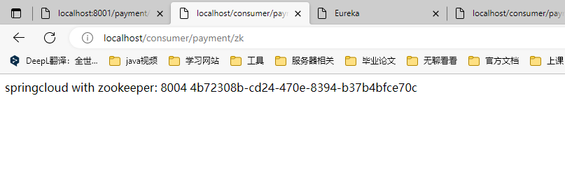

# 31-32.Consul简介、安装和运行

官网[Consul | HashiCorp Developer](https://developer.hashicorp.com/consul "Consul | HashiCorp Developer")

win下载64位解压双击.exe文件后，打开cmd

运行consul -v查看版本号，consul agent -dev启动开发者模式


浏览器输入 - [http://localhost:8500/](http://localhost:8500/ "http://localhost:8500/") - 打开Consul控制页。

# 33.服务提供者注册进consul

**1.建cloud-providerconsul-payment8006**

**2.改pom**

```xml
<?xml version="1.0" encoding="UTF-8"?>
<project xmlns="http://maven.apache.org/POM/4.0.0"
         xmlns:xsi="http://www.w3.org/2001/XMLSchema-instance"
         xsi:schemaLocation="http://maven.apache.org/POM/4.0.0 http://maven.apache.org/xsd/maven-4.0.0.xsd">
    <parent>
        <artifactId>springcloud</artifactId>
        <groupId>com.yxz.springcloud</groupId>
        <version>1.0-SNAPSHOT</version>
    </parent>
    <modelVersion>4.0.0</modelVersion>

    <artifactId>cloud-providerconsul-payment8006</artifactId>
    <dependencies>
        <!--SpringCloud consul-server -->
        <dependency>
            <groupId>org.springframework.cloud</groupId>
            <artifactId>spring-cloud-starter-consul-discovery</artifactId>
        </dependency>
        <!-- SpringBoot整合Web组件 -->
        <dependency>
            <groupId>org.springframework.boot</groupId>
            <artifactId>spring-boot-starter-web</artifactId>
        </dependency>
        <dependency>
            <groupId>org.springframework.boot</groupId>
            <artifactId>spring-boot-starter-actuator</artifactId>
        </dependency>
        <!--日常通用jar包配置-->
        <dependency>
            <groupId>org.springframework.boot</groupId>
            <artifactId>spring-boot-devtools</artifactId>
            <scope>runtime</scope>
            <optional>true</optional>
        </dependency>
        <dependency>
            <groupId>org.projectlombok</groupId>
            <artifactId>lombok</artifactId>
            <optional>true</optional>
        </dependency>
        <dependency>
            <groupId>org.springframework.boot</groupId>
            <artifactId>spring-boot-starter-test</artifactId>
            <scope>test</scope>
        </dependency>
    </dependencies>

</project>
```

**3.写yml**

```yaml
###consul服务端口号
server:
  port: 8006

spring:
  application:
    name: consul-provider-payment
  ####consul注册中心地址
  cloud:
    consul:
      host: localhost
      port: 8500
      discovery:
        #hostname: 127.0.0.1
        service-name: ${spring.application.name}


```

**4.主启动**

```java
@SpringBootApplication
@EnableDiscoveryClient
public class PaymentMain8006 {
    public static void main(String[] args) {
        SpringApplication.run(PaymentMain8006.class, args);
    }
}

```

**5.业务类**

```java
package com.yxz.springcloud.controller;

import org.springframework.beans.factory.annotation.Value;
import org.springframework.web.bind.annotation.GetMapping;
import org.springframework.web.bind.annotation.RequestMapping;
import org.springframework.web.bind.annotation.RestController;

import java.util.UUID;

@RestController
@RequestMapping("/payment")
public class PaymentController
{
    @Value("${server.port}")
    private String serverPort;

    @GetMapping("/consul")
    public String paymentInfo()
    {
        return "springcloud with consul: "+serverPort+"\t\t"+ UUID.randomUUID().toString();
    }
}
```

**6.测试**

成功


# 34.服务消费者注册进consul

**1.建cloud-consumerconsul-order80**

**2.改pom**

```xml
<?xml version="1.0" encoding="UTF-8"?>
<project xmlns="http://maven.apache.org/POM/4.0.0"
         xmlns:xsi="http://www.w3.org/2001/XMLSchema-instance"
         xsi:schemaLocation="http://maven.apache.org/POM/4.0.0 http://maven.apache.org/xsd/maven-4.0.0.xsd">
    <parent>
        <artifactId>springcloud</artifactId>
        <groupId>com.yxz.springcloud</groupId>
        <version>1.0-SNAPSHOT</version>
    </parent>
    <modelVersion>4.0.0</modelVersion>

    <artifactId>cloud-consumerconsul-order80</artifactId>

    <dependencies>
        <!--SpringCloud consul-server -->
        <dependency>
            <groupId>org.springframework.cloud</groupId>
            <artifactId>spring-cloud-starter-consul-discovery</artifactId>
        </dependency>
        <!-- SpringBoot整合Web组件 -->
        <dependency>
            <groupId>org.springframework.boot</groupId>
            <artifactId>spring-boot-starter-web</artifactId>
        </dependency>
        <dependency>
            <groupId>org.springframework.boot</groupId>
            <artifactId>spring-boot-starter-actuator</artifactId>
        </dependency>
        <!--日常通用jar包配置-->
        <dependency>
            <groupId>org.springframework.boot</groupId>
            <artifactId>spring-boot-devtools</artifactId>
            <scope>runtime</scope>
            <optional>true</optional>
        </dependency>
        <dependency>
            <groupId>org.projectlombok</groupId>
            <artifactId>lombok</artifactId>
            <optional>true</optional>
        </dependency>
        <dependency>
            <groupId>org.springframework.boot</groupId>
            <artifactId>spring-boot-starter-test</artifactId>
            <scope>test</scope>
        </dependency>
    </dependencies>

</project>
```

**3.写yml**

```yaml
###consul服务端口号
server:
  port: 80

spring:
  application:
    name: cloud-consumer-order
  ####consul注册中心地址
  cloud:
    consul:
      host: localhost
      port: 8500
      discovery:
        #hostname: 127.0.0.1
        service-name: ${spring.application.name}

```

**4.主启动**

```java
@SpringBootApplication
@EnableDiscoveryClient
public class OrderConsulMain80 {
    public static void main(String[] args) {
        SpringApplication.run(OrderConsulMain80.class, args);
    }
}

```

**5.业务类**

配置类

```java
@Configuration
public class ApplicationContextBean {
    @Bean
    @LoadBalanced
    public RestTemplate getRestTemplate() {
        return new RestTemplate();
    }
}
```

controller

```java
@RequestMapping("/consumer")
@RestController
public class OrderConsulController {

    public static final String INVOKE_URL = "http://consul-provider-payment";   //consul-provider-payment
    @Resource
    private RestTemplate restTemplate;

    @GetMapping("/payment/consul")
    public String paymentInfo() {
        String forObject = restTemplate.getForObject(INVOKE_URL + "/payment/consul", String.class);
        System.out.println("消费者调用支付服务(consule)--->result:" + forObject);
        return forObject;
    }
}
```

**6.测试**

[http://localhost/consumer/payment/consul](http://localhost/consumer/payment/consul "http://localhost/consumer/payment/consul")


# 35.三个注册中心的异同点

| 组件名       | 语言CAP | 服务健康检查 | 对外暴露接口 | Spring Cloud集成 |
| --------- | ----- | ------ | ------ | -------------- |
| Eureka    | Java  | AP     | 可配支持   | HTTP           |
| Consul    | Go    | CP     | 支持     | HTTP/DNS       |
| Zookeeper | Java  | CP     | 支持客户端  | 已集成            |

CAP：

*   C：Consistency (强一致性)

*   A：Availability (可用性)

*   P：Partition tolerance （分区容错性)


**最多只能同时较好的满足两个**。

CAP理论的核心是：**一个分布式系统不可能同时很好的满足一致性，可用性和分区容错性这三个需求**。

因此，根据CAP原理将NoSQL数据库分成了满足CA原则、满足CP原则和满足AP原则三大类:

*   CA - 单点集群，满足—致性，可用性的系统，通常在可扩展性上不太强大。

*   CP - 满足一致性，分区容忍必的系统，通常性能不是特别高。

*   AP - 满足可用性，分区容忍性的系统，通常可能对一致性要求低一些

***

到此已经学习完cloud课程的25.65%内容，和前七章节的内容


# SpringCloud学习笔记36-46

# 36.Ribbon入门

Spring Cloud Ribbon是基于Netflix Ribbon实现的一套**客户端负载均衡的工具**。主要功能是**提供客户端的软件负载均衡算法和服务调用**。

**LB负载均衡(Load Balance)是什么**
简单的说就是将用户的请求平摊的分配到多个服务上，从而达到系统的HA（高可用）。

**Ribbon本地负载均衡客户端 VS Nginx服务端负载均衡区别**

*   Nginx是服务器负载均衡，客户端所有请求都会交给nginx，然后由nginx实现转发请求。即负载均衡是由服务端实现的。

*   Ribbon本地负载均衡，在调用微服务接口时候，会在注册中心上获取注册信息服务列表之后缓存到JVM本地，从而在本地实现RPC远程服务调用技术。

1.  集中式LB：即在服务的消费方和提供方之间使用独立的LB设施(可以是硬件，如F5, 也可以是软件，如nginx), 由该设施负责把访问请求通过某种策略转发至服务的提供方；

2.  进程内LB：将LB逻辑集成到消费方，消费方从服务注册中心获知有哪些地址可用，然后自己再从这些地址中选择出一个合适的服务器。Ribbon就属于进程内LB，它只是一个类库，集成于消费方进程，消费方通过它来获取到服务提供方的地址。

**一句话**

负载均衡 + RestTemplate调用

# 37.Ribbon的负载均衡和Rest调用

**架构说明**

总结：Ribbon其实就是一个软负载均衡的客户端组件，他可以和其他所需请求的客户端结合使用，和eureka结合只是其中的一个实例。


Ribbon在工作时分成两步

*   第一步先选择 EurekaServer ,它优先选择在同一个区域内负载较少的server.

*   第二步再根据用户指定的策略，在从server取到的服务注册列表中选择一个地址。

其中Ribbon提供了多种策略：比如轮询、随机和根据响应时间加权。

**RestTemplate的使用**

**getForObjiect和getForEntity方法**

getForObject()：返回对象为响应体中数据转化成的对象，基本上可以理解为Json。

getForEntity()：返回对象为ResponseEntity对象，包含了响应中的一些重要信息，比如响应头、响应状态码、响应体等。

**postForObjiect和postForEntity方法同理**

```java
@GetMapping("/getForEntity/{id}")
public CommonResult<Payment> getPayment2(@PathVariable("id") Long id) {
    ResponseEntity<CommonResult> entity = restTemplate.getForEntity(PAYMENT_URL + "/payment/" + id, CommonResult.class);
    if (entity.getStatusCode().is2xxSuccessful()) {
        return entity.getBody();
    } else {
        return new CommonResult<>(444,"操作失败");
    }
}
```

# 38.Ribbon默认自带的负载规则


IRule接口

*   RoundRobinRule 轮询

*   RandomRule 随机

*   RetryRule 先按照RoundRobinRule的策略获取服务，如果获取服务失败则在指定时间内会进行重

*   WeightedResponseTimeRule 对RoundRobinRule的扩展，响应速度越快的实例选择权重越大，越容易被选择

*   BestAvailableRule 会先过滤掉由于多次访问故障而处于断路器跳闸状态的服务，然后选择一个并发量最小的服务

*   AvailabilityFilteringRule 先过滤掉故障实例，再选择并发较小的实例

*   ZoneAvoidanceRule 默认规则,复合判断server所在区域的性能和server的可用性选择服务器

# 39.Ribbon负载规则替换

1.  修改cloud-consumer-order80

2.  注意不能放在@ComponentScan能扫码的包下

3.  新建package-com.yxz.myrule

4.  新建类MySelfRule

5.  主启动添加注解@RibbonClient(name = "CLOUD-PAYMENT-SERVICE", configuration = MyselfRule.class)

```java
@Configuration
public class MyselfRule {
    @Bean
    public IRule myRule() {
        return new RandomRule();
    }
}
```

```java
@EnableEurekaClient
@SpringBootApplication
@RibbonClient(name = "CLOUD-PAYMENT-SERVICE", configuration = MyselfRule.class)
public class MainApp80 {
    public static void main(String[] args) {
        SpringApplication.run(MainApp80.class, args);
    }
}
```

测试，无误

# 40.Ribbon默认负载轮询算法原理

**默认负载轮训算法: rest接口第几次请求数 % 服务器集群总数量 = 实际调用服务器位置下标，每次服务重启动后rest接口计数从1开始**。

`List<Servicelnstance> instances = discoveryClient.getInstances("CLOUD-PAYMENT-SERVICE");`

# 41.RoundRobinRule源码分析

```java
public interface IRule{
    /*
     * choose one alive server from lb.allServers or
     * lb.upServers according to key
     * 
     * @return choosen Server object. NULL is returned if none
     *  server is available 
     */

    public Server choose(Object key);
    
    public void setLoadBalancer(ILoadBalancer lb);
    
    public ILoadBalancer getLoadBalancer();    
}

```

```java
package com.netflix.loadbalancer;

import com.netflix.client.config.IClientConfig;
import org.slf4j.Logger;
import org.slf4j.LoggerFactory;

import java.util.List;
import java.util.concurrent.atomic.AtomicInteger;

/**
 * The most well known and basic load balancing strategy, i.e. Round Robin Rule.
 *
 * @author stonse
 * @author Nikos Michalakis <nikos@netflix.com>
 *
 */
public class RoundRobinRule extends AbstractLoadBalancerRule {

    private AtomicInteger nextServerCyclicCounter;
    private static final boolean AVAILABLE_ONLY_SERVERS = true;
    private static final boolean ALL_SERVERS = false;

    private static Logger log = LoggerFactory.getLogger(RoundRobinRule.class);

    public RoundRobinRule() {
        nextServerCyclicCounter = new AtomicInteger(0);
    }

    public RoundRobinRule(ILoadBalancer lb) {
        this();
        setLoadBalancer(lb);
    }

    //重点关注这方法。
    public Server choose(ILoadBalancer lb, Object key) {
        if (lb == null) {
            log.warn("no load balancer");
            return null;
        }

        Server server = null;
        int count = 0;
        while (server == null && count++ < 10) {
            List<Server> reachableServers = lb.getReachableServers();
            List<Server> allServers = lb.getAllServers();
            int upCount = reachableServers.size();
            int serverCount = allServers.size();

            if ((upCount == 0) || (serverCount == 0)) {
                log.warn("No up servers available from load balancer: " + lb);
                return null;
            }

            int nextServerIndex = incrementAndGetModulo(serverCount);
            server = allServers.get(nextServerIndex);

            if (server == null) {
                /* Transient. */
                Thread.yield();
                continue;
            }

            if (server.isAlive() && (server.isReadyToServe())) {
                return (server);
            }

            // Next.
            server = null;
        }

        if (count >= 10) {
            log.warn("No available alive servers after 10 tries from load balancer: "
                    + lb);
        }
        return server;
    }

    /**
     * Inspired by the implementation of {@link AtomicInteger#incrementAndGet()}.
     *
     * @param modulo The modulo to bound the value of the counter.
     * @return The next value.
     */
    private int incrementAndGetModulo(int modulo) {
        for (;;) {
            int current = nextServerCyclicCounter.get();
            int next = (current + 1) % modulo;//求余法
            if (nextServerCyclicCounter.compareAndSet(current, next))
                return next;
        }
    }

    @Override
    public Server choose(Object key) {
        return choose(getLoadBalancer(), key);
    }

    @Override
    public void initWithNiwsConfig(IClientConfig clientConfig) {
    }
}

```

# 42.Ribbon之手写轮询算法

这里看上一节源码和这一节手写过程中不算很清晰，全部看完之后回头看发现挺简单。也不要被弹幕影响，本人还没学过JUC，做个简单的总结，再展示具体的操作。

1.8001和8002提供一个`/payment/lb`接口，返回值就是自己的端口

2.80，提供一个接口`/consumer/payment/lb`需要实现的内容是，轮询调用8001和8002的`/payment/lb`接口，并返回值。

3.80，`/consumer/payment/lb`中首先需要得到，注册中心中，有多少个名为`"CLOUD-PAYMENT-SERVICE"`的服务可用，并返回list。

4.80，我有一个LB的类，我把3中得到的Servicelist传入进去，需要告诉我一个int类型的返回值index，我去取Servicelist的第index的uri去调用即可。（到此80新加的接口就完成使命了，重点来到了，这个需要手动实现的LB类）

**5.重点来了**

首先是低配版的lb：类中维护了一个int型的变量名为next，传入Servicelist，返回next的值，并且把next++供下次调用。

高配版的lb：需要保证原子性，引入JUC的`private AtomicInteger atomicInteger = new AtomicInteger(0);`实现的功能和低配版一样。

笔记代码如下

1.更改8001和8002的controller

```java
@GetMapping(value = "/lb")
public String getPaymentLB(){
    return serverPort;
}
```

2.80中 注销ApplicationConfig的@LoadBalanced注解，和启动类上的@RibbonClient注解

3.80中添加controller方法

```java
@Resource
private LoadBalance loadBalance;

@Autowired
private RestTemplate restTemplate;

@Resource
private DiscoveryClient discoveryClient;
@GetMapping(value = "/lb")
public String getPaymentLB() {
    List<ServiceInstance> instances = discoveryClient.getInstances("CLOUD-PAYMENT-SERVICE");
    if (instances == null || instances.size() <= 0) {
        return null;
    }
    ServiceInstance serviceInstance = loadBalance.instance(instances);
    URI uri = serviceInstance.getUri();
    return restTemplate.getForObject(uri + "/payment/lb", String.class);
}
```

4.添加LoadBalance接口（为了规范化）

```java
public interface LoadBalance {
    ServiceInstance instance(List<ServiceInstance> serviceInstances);
}

```

5.添加MyLB是LoadBalance的实现类

```java
@Component
public class MyLB implements LoadBalance {

    private AtomicInteger atomicInteger = new AtomicInteger(0);

    public final int getAndIncrement() {
        int current;
        int next;
        do {
            current = atomicInteger.get();
            next = current >= 2145483647 ? 0 : current + 1;
        } while (!this.atomicInteger.compareAndSet(current, next));
        System.out.println("*******next:" + next);
        return next;
    }

    @Override
    public ServiceInstance instance(List<ServiceInstance> serviceInstances) {
        int index =  getAndIncrement() % serviceInstances.size();
        return serviceInstances.get(index);
    }
}

```

6.测试

无误

# 43.OpenFeign是什么

Feign是一个声明式的Web服务客户端，让编写Web服务客户端变得非常容易，只需创建一个接口并在接口上添加注解即可

**Feign集成了Ribbon**

利用Ribbon维护了Payment的服务列表信息，并且通过轮询实现了客户端的负载均衡。而与Ribbon不同的是，**通过feign只需要定义服务绑定接口且以声明式的方法**，优雅而简单的实现了服务调用。

# 44.OpenFeign服务调用

**1.建cloud-consumer-feign-order80**

**2.pom**

```xml
<?xml version="1.0" encoding="UTF-8"?>
<project xmlns="http://maven.apache.org/POM/4.0.0"
         xmlns:xsi="http://www.w3.org/2001/XMLSchema-instance"
         xsi:schemaLocation="http://maven.apache.org/POM/4.0.0 http://maven.apache.org/xsd/maven-4.0.0.xsd">
    <parent>
        <artifactId>springcloud</artifactId>
        <groupId>com.yxz.springcloud</groupId>
        <version>1.0-SNAPSHOT</version>
    </parent>
    <modelVersion>4.0.0</modelVersion>

    <artifactId>cloud-consumer-feign-order80</artifactId>

    <dependencies>
        <!--openfeign-->
        <dependency>
            <groupId>org.springframework.cloud</groupId>
            <artifactId>spring-cloud-starter-openfeign</artifactId>
        </dependency>
        <!--eureka client-->
        <dependency>
            <groupId>org.springframework.cloud</groupId>
            <artifactId>spring-cloud-starter-netflix-eureka-client</artifactId>
        </dependency>
        <!-- 引入自己定义的api通用包，可以使用Payment支付Entity -->
        <dependency>
            <groupId>com.yxz.springcloud</groupId>
            <artifactId>cloud-api-commons</artifactId>
            <version>${project.version}</version>
        </dependency>
        <!--web-->
        <dependency>
            <groupId>org.springframework.boot</groupId>
            <artifactId>spring-boot-starter-web</artifactId>
        </dependency>
        <dependency>
            <groupId>org.springframework.boot</groupId>
            <artifactId>spring-boot-starter-actuator</artifactId>
        </dependency>
        <!--一般基础通用配置-->
        <dependency>
            <groupId>org.springframework.boot</groupId>
            <artifactId>spring-boot-devtools</artifactId>
            <scope>runtime</scope>
            <optional>true</optional>
        </dependency>
        <dependency>
            <groupId>org.projectlombok</groupId>
            <artifactId>lombok</artifactId>
            <optional>true</optional>
        </dependency>
        <dependency>
            <groupId>org.springframework.boot</groupId>
            <artifactId>spring-boot-starter-test</artifactId>
            <scope>test</scope>
        </dependency>
    </dependencies>

</project>
```

**3.yml**

```yaml
server:
  port: 80

eureka:
  client:
    register-with-eureka: false
    service-url:
      defaultZone: http://eureka7001.com:7001/eureka/,http://eureka7002.com:7002/eureka/

```

**4.主启动**

```java
@SpringBootApplication
@EnableFeignClients   /*启动注解*/
public class OrderFeignMain80 {
    public static void main(String[] args) {
        SpringApplication.run(OrderFeignMain80.class, args);
    }
}
```

**5.业务类**

新建com.yxz.springcloud.service

```java
import com.yxz.springcloud.entities.CommonResult;
import com.yxz.springcloud.entities.Payment;
import org.springframework.cloud.openfeign.FeignClient;
import org.springframework.stereotype.Component;
import org.springframework.stereotype.Service;
import org.springframework.web.bind.annotation.GetMapping;
import org.springframework.web.bind.annotation.PathVariable;

/**
 * @author yangxiaozhuo
 * @date 2022/11/07
 */
@Component
@FeignClient(value = "CLOUD-PAYMENT-SERVICE")
public interface PaymentFeignService {
    @GetMapping(value = "/payment/{id}")
    public CommonResult<Payment> getPaymentById(@PathVariable("id") Long id);

    @GetMapping(value = "/payment/feign/timeout")
    String paymentFeignTimeOut();
}

```

controller

```java
package com.yxz.springcloud.controller;

import com.yxz.springcloud.entities.CommonResult;
import com.yxz.springcloud.entities.Payment;
import com.yxz.springcloud.service.PaymentFeignService;
import lombok.extern.slf4j.Slf4j;
import org.springframework.web.bind.annotation.GetMapping;
import org.springframework.web.bind.annotation.PathVariable;
import org.springframework.web.bind.annotation.RestController;

import javax.annotation.Resource;

/**
 * @author yangxiaozhuo
 * @date 2022/11/07
 */
@RestController
@Slf4j
public class OrderFeignController {
    @Resource
    private PaymentFeignService paymentFeignService;

    @GetMapping("/consumer/payment/get/{id}")
    public CommonResult<Payment> getPaymentById(@PathVariable("id") Long id) {
        return paymentFeignService.getPaymentById(id);
    }

    @GetMapping(value = "/consumer/payment/feign/timeout")
    public String paymentFeignTimeOut(){
        return paymentFeignService.paymentFeignTimeOut();
    }
}

```

**6.测试**

# 45.OpenFeign超时控制

**超时设置，故意设置超时演示出错情况**

1.服务提供方8001故意写暂停程序

```java
@GetMapping(value = "/feign/timeout")
public String paymentFeignTimeOut()
{
    System.out.println("*****paymentFeignTimeOut from port: "+serverPort);
    //暂停几秒钟线程
    try { TimeUnit.SECONDS.sleep(3); } catch (InterruptedException e) { e.printStackTrace(); }
    return serverPort;
}
```

测试


这是因为feign默认是1秒钟等待响应，在80的yml中配置超时等待时间

```yaml
#设置feign客户端超时时间(OpenFeign默认支持ribbon)(单位：毫秒)
ribbon:
  #指的是建立连接所用的时间，适用于网络状况正常的情况下,两端连接所用的时间
  ReadTimeout: 5000
  #指的是建立连接后从服务器读取到可用资源所用的时间
  ConnectTimeout: 5000
```

**测试**

成功访问


# 46.OpenFeign日志增强

**日志级别**

*   NONE：默认的，不显示任何日志;

*   BASIC：仅记录请求方法、URL、响应状态码及执行时间;

*   HEADERS：除了BASIC中定义的信息之外，还有请求和响应的头信息;

*   FULL：除了HEADERS中定义的信息之外，还有请求和响应的正文及元数据。

**新增配置Bean**

```java
@Configuration
public class FeiginConfig {
    @Bean
    public Logger.Level serLogerLevel() {
        return Logger.Level.FULL;
    }
}
```

**新增yml设置**

```yaml
logging:
  level:
    # feign日志以什么级别监控哪个接口
    com.yxz.springcloud.service.PaymentFeignService: debug
```

测试，控制台打印更多信息


# SpringCloud学习笔记47-64

# 47.Hystrix是什么

分布式系统面临的问题
复杂分布式体系结构中的应用程序有数十个依赖关系，每个依赖关系在某些时候将不可避免地失败。


**服务雪崩**
多个微服务之间调用的时候，假设微服务A调用微服务B和微服务C，微服务B和微服务C又调用其它的微服务，这就是所谓的“扇出”。如果扇出的链路上某个微服务的调用响应时间过长或者不可用，对微服务A的调用就会占用越来越多的系统资源，进而引起系统崩溃，所谓的“雪崩效应”.

所以，通常当你发现一个模块下的某个实例失败后，这时候这个模块依然还会接收流量，然后这个有问题的模块还调用了其他的模块，这样就会发生级联故障，或者叫雪崩。

**Hystrix是什么**

Hystrix是一个用于处理分布式系统的延迟和容错的开源库，在分布式系统里，许多依赖不可避免的会调用失败，比如超时、异常等，Hystrix能够保证在一个依赖出问题的情况下，**不会导致整体服务失败，避免级联故障，以提高分布式系统的弹性。向调用方返回一个符合预期的、可处理的备选响应（FallBack），而不是长时间的等待或者抛出调用方无法处理的异常**

# 48.Hystrix停更进维

**能干嘛**

*   服务降级

*   服务熔断

*   接近实对的监控

# 49.Hystrix的服务降级熔断限流概念初讲

**服务降级**

服务器忙，请稍后再试，不让客户端等待并立刻返回一个友好提示，fallback

**服务熔断**

类比保险丝达到最大服务访问后，直接拒绝访问，拉闸限电，然后调用服务降级的方法并返回友好提示

**服务限流**

秒杀高并发等操作，严禁一窝蜂的过来拥挤，大家排队，一秒钟N个，有序进行

哪些情况会出发降级？

*   程序运行异常

*   超时

*   服务熔断触发服务降级

*   线程池/信号量打满也会导致服务降级

# 50.Hystrix支付微服务构建

**1.建cloud-provider-hystrix-payment8001**

**2.改pom**

```xml
<?xml version="1.0" encoding="UTF-8"?>
<project xmlns="http://maven.apache.org/POM/4.0.0"
         xmlns:xsi="http://www.w3.org/2001/XMLSchema-instance"
         xsi:schemaLocation="http://maven.apache.org/POM/4.0.0 http://maven.apache.org/xsd/maven-4.0.0.xsd">
    <parent>
        <artifactId>springcloud</artifactId>
        <groupId>com.yxz.springcloud</groupId>
        <version>1.0-SNAPSHOT</version>
    </parent>
    <modelVersion>4.0.0</modelVersion>

    <artifactId>cloud-provider-hystrix-payment8001</artifactId>
    <dependencies>
        <!--hystrix-->
        <dependency>
            <groupId>org.springframework.cloud</groupId>
            <artifactId>spring-cloud-starter-netflix-hystrix</artifactId>
        </dependency>
        <!--eureka client-->
        <dependency>
            <groupId>org.springframework.cloud</groupId>
            <artifactId>spring-cloud-starter-netflix-eureka-client</artifactId>
        </dependency>
        <!--web-->
        <dependency>
            <groupId>org.springframework.boot</groupId>
            <artifactId>spring-boot-starter-web</artifactId>
        </dependency>
        <dependency>
            <groupId>org.springframework.boot</groupId>
            <artifactId>spring-boot-starter-actuator</artifactId>
        </dependency>
        <dependency><!-- 引入自己定义的api通用包，可以使用Payment支付Entity -->
            <groupId>com.yxz.springcloud</groupId>
            <artifactId>cloud-api-commons</artifactId>
            <version>${project.version}</version>
        </dependency>
        <dependency>
            <groupId>org.springframework.boot</groupId>
            <artifactId>spring-boot-devtools</artifactId>
            <scope>runtime</scope>
            <optional>true</optional>
        </dependency>
        <dependency>
            <groupId>org.projectlombok</groupId>
            <artifactId>lombok</artifactId>
            <optional>true</optional>
        </dependency>
        <dependency>
            <groupId>org.springframework.boot</groupId>
            <artifactId>spring-boot-starter-test</artifactId>
            <scope>test</scope>
        </dependency>
    </dependencies>


</project>
```

**3.写yml**

```yaml
server:
  port: 8001

spring:
  application:
    name: cloud-provider-hystrix-payment

eureka:
  client:
    register-with-eureka: true
    fetch-registry: true
    service-url:
      #defaultZone: http://eureka7001.com:7001/eureka,http://eureka7002.com:7002/eureka
      defaultZone: http://eureka7001.com:7001/eureka

```

**4.主启动**

```java
@SpringBootApplication
@EnableEurekaClient
public class PaymentHystrixMain8001 {
    public static void main(String[] args) {
        SpringApplication.run(PaymentHystrixMain8001.class, args);
    }
}
```

**5.业务类**

controller

```java
@RequestMapping("/payment")
@RestController
public class PaymentController {

    @Resource
    private PaymentService paymentService;

    @Value("${server.port}")
    private String serverPort;

    @GetMapping("/hystrix/ok/{id}")
    public String paymentInfo_OK(@PathVariable("id") Integer id)
    {
        String result = paymentService.paymentInfo_ok(id);
        System.out.println("****result: "+result);
        return result;
    }

    @GetMapping("/hystrix/timeout/{id}")
    public String paymentInfo_TimeOut(@PathVariable("id") Integer id) throws InterruptedException
    {
        String result = paymentService.paymentInfo_TimeOut(id);
        System.out.println("****result: "+result);
        return result;
    }
}
```

service

```java
@Service
public class PaymentService {
    /**
     * 正常访问，一切OK
     * @param id
     * @return
     */
    public String paymentInfo_ok(Integer id) {
        return "线程池:"+Thread.currentThread().getName()+"paymentInfo_OK,id: "+id+"\t"+"O(∩_∩)O";
    }

    /**
     * 超时访问，演示降级
     * @param id
     * @return
     */
    public String paymentInfo_TimeOut(Integer id)
    {
        try { TimeUnit.SECONDS.sleep(3); } catch (InterruptedException e) { e.printStackTrace(); }
        return "线程池:"+Thread.currentThread().getName()+"paymentInfo_TimeOut,id: "+id+"\t"+"O(∩_∩)O，耗费3秒";
    }
}

```

**6.测试**

# 51.JMeter高并发压测后卡顿

**Jmeter压测测试**


此时访问`localhost:8001/payment/hystrix/ok/31`也会响应变慢

# 52.订单微服务调用支付服务出现卡顿

**看热闹不嫌弃事大，80新建加入**

**1.新建 - cloud-consumer-feign-hystrix-order80**

**2.POM**

```xml
<?xml version="1.0" encoding="UTF-8"?>
<project xmlns="http://maven.apache.org/POM/4.0.0"
         xmlns:xsi="http://www.w3.org/2001/XMLSchema-instance"
         xsi:schemaLocation="http://maven.apache.org/POM/4.0.0 http://maven.apache.org/xsd/maven-4.0.0.xsd">
    <parent>
        <artifactId>springcloud</artifactId>
        <groupId>com.yxz.springcloud</groupId>
        <version>1.0-SNAPSHOT</version>
    </parent>
    <modelVersion>4.0.0</modelVersion>

    <artifactId>cloud-consumer-feign-hystrix-order80</artifactId>
    <dependencies>
        <!--openfeign-->
        <dependency>
            <groupId>org.springframework.cloud</groupId>
            <artifactId>spring-cloud-starter-openfeign</artifactId>
        </dependency>
        <!--hystrix-->
        <dependency>
            <groupId>org.springframework.cloud</groupId>
            <artifactId>spring-cloud-starter-netflix-hystrix</artifactId>
        </dependency>
        <!--eureka client-->
        <dependency>
            <groupId>org.springframework.cloud</groupId>
            <artifactId>spring-cloud-starter-netflix-eureka-client</artifactId>
        </dependency>
        <!-- 引入自己定义的api通用包，可以使用Payment支付Entity -->
        <dependency>
            <groupId>com.yxz.springcloud</groupId>
            <artifactId>cloud-api-commons</artifactId>
            <version>${project.version}</version>
        </dependency>
        <!--web-->
        <dependency>
            <groupId>org.springframework.boot</groupId>
            <artifactId>spring-boot-starter-web</artifactId>
        </dependency>
        <dependency>
            <groupId>org.springframework.boot</groupId>
            <artifactId>spring-boot-starter-actuator</artifactId>
        </dependency>
        <!--一般基础通用配置-->
        <dependency>
            <groupId>org.springframework.boot</groupId>
            <artifactId>spring-boot-devtools</artifactId>
            <scope>runtime</scope>
            <optional>true</optional>
        </dependency>
        <dependency>
            <groupId>org.projectlombok</groupId>
            <artifactId>lombok</artifactId>
            <optional>true</optional>
        </dependency>
        <dependency>
            <groupId>org.springframework.boot</groupId>
            <artifactId>spring-boot-starter-test</artifactId>
            <scope>test</scope>
        </dependency>
    </dependencies>
</project>
```

**3.yml**

```yaml
server:
  port: 80

eureka:
  client:
    register-with-eureka: false
    service-url:
      defaultZone: http://eureka7001.com:7001/eureka

```

**4.主启动**

```java
@SpringBootApplication
@EnableFeignClients
public class OrderHystrixMain80 {
    public static void main(String[] args) {
        SpringApplication.run(OrderHystrixMain80.class, args);
    }
}
```

**5.业务类**

service

```java
@Service
@FeignClient(value = "CLOUD-PROVIDER-HYSTRIX-PAYMENT")
public interface PaymentHystrixService {

    @GetMapping("/payment/hystrix/ok/{id}")
    String paymentInfo_OK(@PathVariable("id") Integer id);

    @GetMapping("/payment/hystrix/timeout/{id}")
    String paymentInfo_TimeOut(@PathVariable("id") Integer id);
}

```

controller

```java
@RestController
@RequestMapping("/consumer")
public class OrderHystirxController {
    @Resource
    private PaymentHystrixService paymentHystrixService;

    @GetMapping("/payment/hystrix/ok/{id}")
    public String paymentInfo_OK(@PathVariable("id") Integer id)
    {
        return paymentHystrixService.paymentInfo_OK(id);
    }

    @GetMapping("/payment/hystrix/timeout/{id}")
    public String paymentInfo_TimeOut(@PathVariable("id") Integer id)
    {
        return paymentHystrixService.paymentInfo_TimeOut(id);
    }

}

```

**6.正常测试**

没问题。80的timeout报错是正常，因为yml没有配置超时时间。

**7.高并发测试**

8001用高并发访问，再去访问80 的ok，有时候会报错。

# 53.降级容错解决的维度要求

超时导致服务器变慢(转圈) - 超时不再等待

出错(宕机或程序运行出错) - 出错要有兜底

解决：

*   对方服务(8001)超时了，调用者(80)不能一直卡死等待，必须有服务降级。

*   对方服务(8001)down机了，调用者(80)不能一直卡死等待，必须有服务降级。

*   对方服务(8001)OK，调用者(80)自己出故障或有自我要求(自己的等待时间小于服务提供者)，自己处理降级。

# 54.Hystrix之服务降级支付侧fallback

8001fallback

设置自身调用超时时间的峰值，峰值内可以正常运行，
超过了需要有兜底的方法处理，作服务降级fallback

**1.主启动类激活**

```java
@SpringBootApplication
@EnableEurekaClient
@EnableCircuitBreaker  /*激活*/
public class PaymentHystrixMain8001 {
    public static void main(String[] args) {
        SpringApplication.run(PaymentHystrixMain8001.class, args);
    }
}
```

**2.业务类**

```java
    @HystrixCommand(fallbackMethod = "paymentInfo_TimeOutHandler",commandProperties = {
            @HystrixProperty(name="execution.isolation.thread.timeoutInMilliseconds",value="3000")
    })
    public String paymentInfo_TimeOut(Integer id)
    {
//        int t = 10 / 0;
        try { TimeUnit.SECONDS.sleep(5); } catch (InterruptedException e) { e.printStackTrace(); }
        return "线程池:"+Thread.currentThread().getName()+"paymentInfo_TimeOut,id: "+id+"\t"+"O(∩_∩)O，耗费5秒";
    }

    public String paymentInfo_TimeOutHandler(Integer id)
    {
        return "线程池:"+Thread.currentThread().getName()+"paymentInfo_TimeOut,id: "+id+"\t"+"/(ㄒoㄒ)/~~";
    }
```

**3.超时测试，成功**

**4.除以0测试，成功**

# 55.Hystrix之服务降级订单侧fallback

80fallback

**1.yml**

```yaml
feign:
  hystrix:
    enabled: true
```

**2.主启动**

```java
@EnableHystrix
```

**3.业务类**

```java
@GetMapping("/payment/hystrix/timeout/{id}")
@HystrixCommand(fallbackMethod = "paymentTimeOutFallbackMethod",commandProperties = {
        @HystrixProperty(name="execution.isolation.thread.timeoutInMilliseconds",value="1500")
})
public String paymentInfo_TimeOut(@PathVariable("id") Integer id)
{
    int a = 1 / 10;
    String result = paymentHystrixService.paymentInfo_TimeOut(id);
    return result;
}
public String paymentTimeOutFallbackMethod(@PathVariable("id") Integer id)
{
    return "我是消费者80,对方支付系统繁忙请10秒钟后再试或者自己运行出错请检查自己,o(╥﹏╥)o";
}
```

**4.测试超时，成功**

**5.测试除以0，成功**

# 56.Hystrix之全局服务降级DefaultProperties

**目前问题1** 每个业务方法对应一个兜底的方法，代码膨胀

解决方法：配置一个默认的兜底方法，非特殊的方法都使用这个默认的方法兜底

```java
@DefaultProperties(defaultFallback = "payment_Global_FallbackMethod")
public class OrderHystirxController {
    ···
    @GetMapping("/payment/hystrix/timeout/{id}")
    @HystrixCommand
    public String paymentInfo_TimeOut(@PathVariable("id") Integer id)
    {
        int a = 1 / 0;
        return paymentHystrixService.paymentInfo_TimeOut(id);
    }
    public String payment_Global_FallbackMethod()
    {
        return "Global异常处理信息，请稍后再试，/(ㄒoㄒ)/~~";
    }
}

```

**测试，成功**

# 57.Hystrix之通配服务降级FeignFallback

**目前问题2** 统一和自定义的分开，代码混乱

服务降级，客户端去调用服务端，碰上服务端宕机或关闭

**未来我们要面对的异常**

*   运行

*   超时

*   宕机

**修改cloud-consumer-feign-hystrix-order80**

重新新建一个类(PaymentFallbackService)实现该接口，统一为接口里面的方法进行异常处理

```java
@Component
public class PaymentFallbackService implements PaymentHystrixService{
    @Override
    public String paymentInfo_OK(Integer id) {
        return "服务调用失败，提示来自：cloud-consumer-feign-order80";
    }

    @Override
    public String paymentInfo_TimeOut(Integer id) {
        return "服务调用失败，提示来自：cloud-consumer-feign-order80";
    }
}

```

PaymentHystrixService接口

```java
@Service
@FeignClient(value = "CLOUD-PROVIDER-HYSTRIX-PAYMENT", fallback = PaymentFallbackService.class)
public interface PaymentHystrixService {

    @GetMapping("/payment/hystrix/ok/{id}")
    String paymentInfo_OK(@PathVariable("id") Integer id);

    @GetMapping("/payment/hystrix/timeout/{id}")
    String paymentInfo_TimeOut(@PathVariable("id") Integer id);
}
```

**测试，成功**

# 58.Hystrix之服务熔断理论

**当检测到该节点微服务调用响应正常后，恢复调用链路。**

在Spring Cloud框架里，熔断机制通过Hystrix实现。Hystrix会监控微服务间调用的状况，

当失败的调用到一定阈值，缺省是5秒内20次调用失败，就会启动熔断机制。熔断机制的注解是@HystrixCommand。

[https://martinfowler.com/bliki/CircuitBreaker.html](https://martinfowler.com/bliki/CircuitBreaker.html "https://martinfowler.com/bliki/CircuitBreaker.html")


# 59.Hystrix之服务熔断案例(上)

# 60.Hystrix之服务熔断案例(下)

**1.修改cloud-provider-hystrix-payment8001**

PaymentService

```java
    //=========服务熔断
    @HystrixCommand(fallbackMethod = "paymentCircuitBreaker_fallback",commandProperties = {
            @HystrixProperty(name = "circuitBreaker.enabled",value = "true"),  //是否开启断路器
            @HystrixProperty(name = "circuitBreaker.requestVolumeThreshold",value = "10"), //请求次数
            @HystrixProperty(name = "circuitBreaker.sleepWindowInMilliseconds",value = "10000"), //时间窗口期
            @HystrixProperty(name = "circuitBreaker.errorThresholdPercentage",value = "60"), //失败率达到多少后跳闸
    })
    public String paymentCircuitBreaker(@PathVariable("id") Integer id)
    {
        if(id < 0)
        {
            throw new RuntimeException("******id 不能负数");
        }
        String serialNumber = IdUtil.simpleUUID();

        return Thread.currentThread().getName()+"\t"+"调用成功，流水号: " + serialNumber;
    }
    public String paymentCircuitBreaker_fallback(@PathVariable("id") Integer id)
    {
        return "id 不能负数，请稍后再试，/(ㄒoㄒ)/~~   id: " +id;
    }
```

PaymentController

```java
@GetMapping("/circuit/{id}")
    public String paymentCircuitBreaker(@PathVariable("id") Integer id)
    {
        String result = paymentService.paymentCircuitBreaker(id);
        log.info("****result: "+result);
        return result;
    }
```

**测试，成功**

# 61.Hystrix之服务熔断总结

熔断类型

*   熔断打开：请求不再进行调用当前服务，内部设置时钟一般为MTTR（平均故障处理时间)，当打开时长达到所设时钟则进入半熔断状态

*   熔断关闭：熔断关闭不会对服务进行熔断

*   熔断半开：部分请求根据规则调用当前服务，如果请求成功且符合规则则认为当前服务恢复正常，关闭熔断

断路器在什么情况下开始起作用


涉及到断路器的三个重要参数：快照时间窗、请求总数阀值、错误百分比阀值。

1：快照时间窗：断路器确定是否打开需要统计一些请求和错误数据，而统计的时间范围就是快照时间窗，默认为最近的10秒。

2：请求总数阀值：在快照时间窗内，必须满足请求总数阀值才有资格熔断。默认为20，意味着在10秒内，如果该hystrix命令的调用次数不足20次，即使所有的请求都超时或其他原因失败，断路器都不会打开。

3：错误百分比阀值：当请求总数在快照时间窗内超过了阀值，比如发生了30次调用，如果在这30次调用中，有15次发生了超时异常，也就是超过50%的错误百分比，在默认设定50%阀值情况下，这时候就会将断路器打开。

断路器打开之后：

1：再有请求调用的时候，将不会调用主逻辑，而是直接调用降级fallback。通过断路器，实现了自动地发现错误并将降级逻辑切换为主逻辑，减少响应延迟的效果。

2：原来的主逻辑要如何恢复呢？

对于这一问题，hystrix也为我们实现了自动恢复功能。

当断路器打开，对主逻辑进行熔断之后，hystrix会启动一个休眠时间窗，在这个时间窗内，降级逻辑是临时的成为主逻辑，

当休眠时间窗到期，断路器将进入半开状态，释放一次请求到原来的主逻辑上，如果此次请求正常返回，那么断路器将继续闭合，

主逻辑恢复，如果这次请求依然有问题，断路器继续进入打开状态，休眠时间窗重新计时。

# 62.Hystrix工作流程最后总结


1  创建 HystrixCommand（用在依赖的服务返回单个操作结果的时候） 或 HystrixObserableCommand（用在依赖的服务返回多个操作结果的时候） 对象。

2  命令执行。其中 HystrixComand 实现了下面前两种执行方式；而 HystrixObservableCommand 实现了后两种执行方式：execute()：同步执行，从依赖的服务返回一个单一的结果对象， 或是在发生错误的时候抛出异常。queue()：异步执行， 直接返回 一个Future对象， 其中包含了服务执行结束时要返回的单一结果对象。observe()：返回 Observable 对象，它代表了操作的多个结果，它是一个 Hot Obserable（不论 "事件源" 是否有 "订阅者"，都会在创建后对事件进行发布，所以对于 Hot Observable 的每一个 "订阅者" 都有可能是从 "事件源" 的中途开始的，并可能只是看到了整个操作的局部过程）。toObservable()： 同样会返回 Observable 对象，也代表了操作的多个结果，但它返回的是一个Cold Observable（没有 "订阅者" 的时候并不会发布事件，而是进行等待，直到有 "订阅者" 之后才发布事件，所以对于 Cold Observable 的订阅者，它可以保证从一开始看到整个操作的全部过程）。

3  若当前命令的请求缓存功能是被启用的， 并且该命令缓存命中， 那么缓存的结果会立即以 Observable 对象的形式 返回。

4  检查断路器是否为打开状态。如果断路器是打开的，那么Hystrix不会执行命令，而是转接到 fallback 处理逻辑（第 8 步）；如果断路器是关闭的，检查是否有可用资源来执行命令（第 5 步）。

5  线程池/请求队列/信号量是否占满。如果命令依赖服务的专有线程池和请求队列，或者信号量（不使用线程池的时候）已经被占满， 那么 Hystrix 也不会执行命令， 而是转接到 fallback 处理逻辑（第8步）。

6  Hystrix 会根据我们编写的方法来决定采取什么样的方式去请求依赖服务。HystrixCommand.run() ：返回一个单一的结果，或者抛出异常。HystrixObservableCommand.construct()： 返回一个Observable 对象来发射多个结果，或通过 onError 发送错误通知。

7  Hystrix会将 "成功"、"失败"、"拒绝"、"超时" 等信息报告给断路器， 而断路器会维护一组计数器来统计这些数据。断路器会使用这些统计数据来决定是否要将断路器打开，来对某个依赖服务的请求进行 "熔断/短路"。

8  当命令执行失败的时候， Hystrix 会进入 fallback 尝试回退处理， 我们通常也称该操作为 "服务降级"。而能够引起服务降级处理的情况有下面几种：第4步： 当前命令处于"熔断/短路"状态，断路器是打开的时候。第5步： 当前命令的线程池、 请求队列或 者信号量被占满的时候。第6步：HystrixObservableCommand.construct() 或 HystrixCommand.run() 抛出异常的时候。

9  当Hystrix命令执行成功之后， 它会将处理结果直接返回或是以Observable 的形式返回。

tips：如果我们没有为命令实现降级逻辑或者在降级处理逻辑中抛出了异常， Hystrix 依然会返回一个 Observable 对象， 但是它不会发射任何结果数据， 而是通过 onError 方法通知命令立即中断请求，并通过onError()方法将引起命令失败的异常发送给调用者。

# 63.Hystrix图形化Dashboard搭建

**仪表盘9001**

**1新建cloud-consumer-hystrix-dashboard9001**

**2.pom**

```xml
<dependencies>
        <dependency>
            <groupId>org.springframework.cloud</groupId>
            <artifactId>spring-cloud-starter-netflix-hystrix-dashboard</artifactId>
        </dependency>
        <dependency>
            <groupId>org.springframework.boot</groupId>
            <artifactId>spring-boot-starter-actuator</artifactId>
        </dependency>

        <dependency>
            <groupId>org.springframework.boot</groupId>
            <artifactId>spring-boot-devtools</artifactId>
            <scope>runtime</scope>
            <optional>true</optional>
        </dependency>
        <dependency>
            <groupId>org.projectlombok</groupId>
            <artifactId>lombok</artifactId>
            <optional>true</optional>
        </dependency>
        <dependency>
            <groupId>org.springframework.boot</groupId>
            <artifactId>spring-boot-starter-test</artifactId>
            <scope>test</scope>
        </dependency>
    </dependencies>
```

**3.yml**

```yaml
server:
  port: 9001

```

**4.主启动**

```java
@SpringBootApplication
@EnableHystrixDashboard
public class HystrixDashboardMain9001 {
    public static void main(String[] args)
    {
        SpringApplication.run(HystrixDashboardMain9001.class,args);
    }
}
```

**6.启动cloud-consumer-hystrix-dashboard9001**

**7.浏览器输入http\://localhost:9001/hystrix**

# 64.Hystrix图形化Dashboard监控实战

**修改cloud-provider-hystrix-payment8001**

注意：新版本Hystrix需要在主启动类PaymentHystrixMain8001中指定监控路径

```java
    /**
     *此配置是为了服务监控而配置，与服务容错本身无关，springcloud升级后的坑
     *ServletRegistrationBean因为springboot的默认路径不是"/hystrix.stream"，
     *只要在自己的项目里配置上下面的servlet就可以了
     */
    @Bean
    public ServletRegistrationBean getServlet() {
        HystrixMetricsStreamServlet streamServlet = new HystrixMetricsStreamServlet();
        ServletRegistrationBean registrationBean = new ServletRegistrationBean(streamServlet);
        registrationBean.setLoadOnStartup(1);
        registrationBean.addUrlMappings("/hystrix.stream");
        registrationBean.setName("HystrixMetricsStreamServlet");
        return registrationBean;
    }
```

**监控测试**

启动7001eureka、8001，9001

**观察监控窗口**

9001监控8001 - 填写监控地址  [http://localhost:8001/hystrix.stream](http://localhost:8001/hystrix.stream "http://localhost:8001/hystrix.stream")

测试地址

*   [http://localhost:8001/payment/circuit/1](http://localhost:8001/payment/circuit/1 "http://localhost:8001/payment/circuit/1")

*   [http://localhost:8001/payment/circuit/-1](http://localhost:8001/payment/circuit/-1 "http://localhost:8001/payment/circuit/-1")

**测试**


**如何看**

*   7色

*   1圈 ：

    共有两种含义。它通过颜色的变化代表了实例的健康程度，它的健康度从绿色<黄色<橙色<红色递减。
    该实心圆除了颜色的变化之外，它的大小也会根据实例的请求流量发生变化，流量越大该实心圆就越大。所以通过该实心圆的展示，就可以在大量的实例中快速的发现故障实例和高压力实例。

*   1线

    曲线：用来记录2分钟内流量的相对变化，可以通过它来观察到流量的上升和下降趋势。

*   整图说明

*   整图说明2


***

到此已经学习完cloud课程的43.95%内容，和前十章节的内容


# SpringCloud学习笔记65-73

# 65.GateWay和Zuul课程说明

# 66.GateWay是什么

上一代zuul 1.X ：[https://github.com/Netflix/zuul/wiki](https://github.com/Netflix/zuul/wiki "https://github.com/Netflix/zuul/wiki")

当前gateway ： [https://cloud.spring.io/spring-cloud-static/spring-cloud-gateway/2.2.1.RELEASE/reference/html/](https://cloud.spring.io/spring-cloud-static/spring-cloud-gateway/2.2.1.RELEASE/reference/html/ "https://cloud.spring.io/spring-cloud-static/spring-cloud-gateway/2.2.1.RELEASE/reference/html/")

Spring Cloud Gateway的目标提供统一的路由方式且基于 Filter 链的方式提供了网关基本的功能，例如：安全，监控/指标，和限流。

**一句话：** SpringCloud Gateway 使用的Webflux中的reactor-netty响应式编程组件，底层使用了Netty通讯框架。

**能干嘛**：

*   方向代理

*   鉴权

*   流量控制

*   熔断

*   日志监控

**微服务架构中网关在哪里**


# 67.GateWay非阻塞异步模型

Servlet是一个简单的网络IO模型，当请求进入Servlet container时，Servlet container就会为其绑定一个线程，在并发不高的场景下这种模型是适用的。但是一旦高并发(如抽风用Jmeter压)，线程数量就会上涨，而线程资源代价是昂贵的（上线文切换，内存消耗大）严重影响请求的处理时间。在一些简单业务场景下，不希望为每个request分配一个线程，只需要1个或几个线程就能应对极大并发的请求，这种业务场景下servlet模型没有优势。

所以Zuul 1.X是基于servlet之上的一个阻塞式处理模型，即spring实现了处理所有request请求的一个servlet（DispatcherServlet）并由该servlet阻塞式处理处理。所以Springcloud Zuul无法摆脱servlet模型的弊端

Spring WebFlux 是 Spring 5.0 引入的新的响应式框架，区别于 Spring MVC，它不需要依赖Servlet API，它是完全异步非阻塞的，并且基于 Reactor 来实现响应式流规范。

# 68.Gateway工作流程

**三大核心概念**

1.  Route(路由) - 路由是构建网关的基本模块,它由ID,目标URI,一系列的断言和过滤器组成,如断言为true则匹配该路由；

2.  Predicate(断言) - 参考的是Java8的java.util.function.Predicate，开发人员可以匹配HTTP请求中的所有内容(例如请求头或请求参数),如果请求与断言相匹配则进行路由；

3.  Filter(过滤) - 指的是Spring框架中GatewayFilter的实例,使用过滤器,可以在请求被路由前或者之后对请求进行修改。

web请求，通过一些匹配条件，定位到真正的服务节点。并在这个转发过程的前后，进行一些精细化控制。
predicate就是我们的匹配条件；
而filter，就可以理解为一个无所不能的拦截器。有了这两个元素，再加上目标uri，就可以实现一个具体的路由了

**Gateway工作流程**

路由转发+执行过滤器链


# 69.Gateway9527搭建

**1.建Module - cloud-gateway-gateway9527**

**2.POM**

```xml
<?xml version="1.0" encoding="UTF-8"?>
<project xmlns="http://maven.apache.org/POM/4.0.0"
         xmlns:xsi="http://www.w3.org/2001/XMLSchema-instance"
         xsi:schemaLocation="http://maven.apache.org/POM/4.0.0 http://maven.apache.org/xsd/maven-4.0.0.xsd">
    <parent>
        <artifactId>springcloud</artifactId>
        <groupId>com.yxz.springcloud</groupId>
        <version>1.0-SNAPSHOT</version>
    </parent>
    <modelVersion>4.0.0</modelVersion>

    <artifactId>cloud-gateway-gateway9527</artifactId>

    <dependencies>
        <!--gateway-->
        <dependency>
            <groupId>org.springframework.cloud</groupId>
            <artifactId>spring-cloud-starter-gateway</artifactId>
        </dependency>
        <!--eureka-client-->
        <dependency>
            <groupId>org.springframework.cloud</groupId>
            <artifactId>spring-cloud-starter-netflix-eureka-client</artifactId>
        </dependency>
        <!-- 引入自己定义的api通用包，可以使用Payment支付Entity -->
        <dependency>
            <groupId>com.yxz.springcloud</groupId>
            <artifactId>cloud-api-commons</artifactId>
            <version>${project.version}</version>
        </dependency>
        <!--一般基础配置类-->
        <dependency>
            <groupId>org.springframework.boot</groupId>
            <artifactId>spring-boot-devtools</artifactId>
            <scope>runtime</scope>
            <optional>true</optional>
        </dependency>
        <dependency>
            <groupId>org.projectlombok</groupId>
            <artifactId>lombok</artifactId>
            <optional>true</optional>
        </dependency>
        <dependency>
            <groupId>org.springframework.boot</groupId>
            <artifactId>spring-boot-starter-test</artifactId>
            <scope>test</scope>
        </dependency>
    </dependencies>


</project>
```

**3.yml**

```yaml
server:
  port: 9527

spring:
  application:
    name: cloud-gateway
    
eureka:
  instance:
    hostname: cloud-gateway-service
  client: #服务提供者provider注册进eureka服务列表内
    service-url:
      register-with-eureka: true
      fetch-registry: true
      defaultZone: http://eureka7001.com:7001/eureka

```

**4.主启动**

```java
@SpringBootApplication
@EnableEurekaClient
public class GateWayMain9527 {
    public static void main(String[] args) {
        SpringApplication.run(GateWayMain9527.class,args);
    }
}
```

**5.要求访问9527能够访问到8001**

**6.新增yml配置**

```yaml
server:
  port: 9527

spring:
  application:
    name: cloud-gateway
  cloud:
    gateway:
      discovery:
        locator:
          enabled: true #开启从注册中心动态创建路由的功能，利用微服务名进行路由
      routes:
        - id: payment_routh #payment_route    #路由的ID，没有固定规则但要求唯一，建议配合服务名
          # uri: http://localhost:8001          #匹配后提供服务的路由地址
          uri: lb://cloud-payment-service #匹配后提供服务的路由地址
          predicates:
            - Path=/payment/get/**         # 断言，路径相匹配的进行路由

        - id: payment_routh2 #payment_route    #路由的ID，没有固定规则但要求唯一，建议配合服务名
          # uri: http://localhost:8001          #匹配后提供服务的路由地址
          uri: lb://cloud-payment-service #匹配后提供服务的路由地址
          predicates:
            - Path=/payment/lb/**         # 断言，路径相匹配的进行路由

eureka:
  instance:
    hostname: cloud-gateway-service
  client: #服务提供者provider注册进eureka服务列表内
    service-url:
      register-with-eureka: true
      fetch-registry: true
      defaultZone: http://eureka7001.com:7001/eureka
 

```

**7.测试**

访问[http://localhost:9527/payment/get/1](http://localhost:9527/payment/get/1 "http://localhost:9527/payment/get/1") 成功

# 70.Gateway配置路由的两种方式

**1.yml配置**

**2.添加配置类bean配置**

```java
@Bean
    public RouteLocator customRouteLocator(RouteLocatorBuilder builder)
    {
        RouteLocatorBuilder.Builder routes = builder.routes();

        routes.route("path_route_atguigu", r -> r.path("/guonei").uri("http://news.baidu.com/guonei")).build();

        return routes.build();

    }
    @Bean
    public RouteLocator customRouteLocator2(RouteLocatorBuilder builder)
    {
        RouteLocatorBuilder.Builder routes = builder.routes();
        routes.route("path_route_atguigu2", r -> r.path("/guoji").uri("http://news.baidu.com/guoji")).build();
        return routes.build();
    }
```

# 71.GateWay配置动态路由

默认情况下Gateway会根据注册中心注册的服务列表，
以注册中心上微服务名为**路径创建动态路由进行转发**，从而实现动态路由的功能

**YML**

需要注意的是uri的协议为lb，表示启用Gateway的负载均衡功能。

**测试**

浏览器输入 - [http://localhost:9527/payment/lb](http://localhost:9527/payment/lb "http://localhost:9527/payment/lb")  成功负载均衡

# 72.GateWay常用的Predicate

1.  The After Route Predicate Factory

    *   After=2020-02-05T15:10:03.685+08:00\[Asia/Shanghai]

2.  The Before Route Predicate Factory

    *   Before=2020-02-05T15:10:03.685+08:00\[Asia/Shanghai]&#x20;

3.  The Between Route Predicate Factory

    *   Between=2020-02-02T17:45:06.206+08:00\[Asia/Shanghai],2020-03-25T18:59:06.206+08:00\[Asia/Shanghai]

4.  The Cookie Route Predicate Factory

    *   要求带上指定cookie

5.  The Header Route Predicate Factory

    *   要求带上指定请求头

6.  The Host Route Predicate Factory

    *   要求指定主机名

7.  The Method Route Predicate Factory

    *   Method=GET要求指定的方法

8.  The Path Route Predicate Factory

    *   Path=/payment/get/\*\* 路径匹配

9.  The Query Route Predicate Factory

    *   Query=username, \d+   后面是正则表达式，要有参数名username并且值还要是整数才能路由

10. The RemoteAddr Route Predicate Factory

11. The weight Route Predicate Factory

# 73.GateWay的Filter

路由过滤器可用于修改进入的HTTP请求和返回的HTTP响应

Spring Cloud Gateway的Filter:

*   生命周期：

    *   pre

    *   post

*   种类（具体看官方文档）：

    *   GatewayFilter - 有31种

    *   GlobalFilter - 有10种

常用的GatewayFilter：AddRequestParameter GatewayFilter

自定义全局GlobalFilter：

代码案例

config类

```java
import org.springframework.cloud.gateway.filter.GatewayFilterChain;
import org.springframework.cloud.gateway.filter.GlobalFilter;
import org.springframework.core.Ordered;
import org.springframework.http.HttpStatus;
import org.springframework.stereotype.Component;
import org.springframework.web.server.ServerWebExchange;
import reactor.core.publisher.Mono;

import java.util.Date;

/**
 * @author yangxiaozhuo
 * @date 2022/11/08
 */
@Component
public class MyLogGateWayFilter implements GlobalFilter, Ordered {

    @Override
    public Mono<Void> filter(ServerWebExchange exchange, GatewayFilterChain chain) {
        System.out.println("****come in 全局过滤器" + new Date());
        String uname = exchange.getRequest().getQueryParams().getFirst("uname");
        if (uname == null) {
            System.out.println("用户名为null");
            exchange.getResponse().setStatusCode(HttpStatus.NOT_ACCEPTABLE);
            return exchange.getResponse().setComplete();
        }
        return chain.filter(exchange);
    }

    @Override
    public int getOrder() {
        return 0;
    }
}

```


# SpringCloud学习笔记74-94

# 74.Config分布式配置中心介绍

&#x20;微服务意味着要将单体应用中的业务拆分成一个个子服务，每个服务的粒度相对较小，因此系统中会出现大量的服务。由于每个服务都需要必要的配置信息才能运行，所以一套集中式的、动态的配置管理设施是必不可少的。

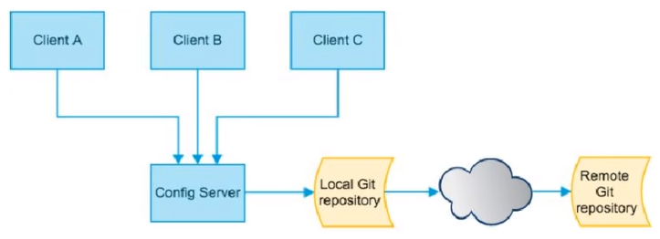

**是什么**

SpringCloud Config为微服务架构中的微服务提供集中化的外部配置支持，配置服务器为**各个不同微服务**应用的所有环境提供了一个**中心化的外部配置**。

怎么玩
SpringCloud Config分为服务端和客户端两部分。

服务端也称为**分布式配置中心，它是一个独立的微服务应用**，用来连接配置服务器并为客户端提供获取配置信息，加密/解密信息等访问接口

客户端则是通过指定的配置中心来管理应用资源，以及与业务相关的配置内容，并在启动的时候从配置中心获取和加载配置信息配置服务器默认采用git来存储配置信息，这样就有助于对环境配置进行版本管理，并且可以通过git客户端工具来方便的管理和访问配置内容。

**能干嘛**

*   集中管理配置文件

*   不同环境不同配置，动态化的配置更新，分环境部署比如dev/test/prod/beta/release

**与GitHub整合配置**

# 75.Config配置总控中心搭建（这里我用了gitee）

用你自己的账号在GitHub上新建一个名为springcloud-config的新Repository

由上一步获得刚新建的git地址 - [https://gitee.com/yang-xiao-bai/springcloud-config.git](https://gitee.com/yang-xiao-bai/springcloud-config.git "https://gitee.com/yang-xiao-bai/springcloud-config.git")这里用ssh可能会报错，踩了一个坑

文件内容见上面地址

客户端配置

**1.建Module模块cloud-config-center-3344**

**2.pom**

```xml
<?xml version="1.0" encoding="UTF-8"?>
<project xmlns="http://maven.apache.org/POM/4.0.0"
         xmlns:xsi="http://www.w3.org/2001/XMLSchema-instance"
         xsi:schemaLocation="http://maven.apache.org/POM/4.0.0 http://maven.apache.org/xsd/maven-4.0.0.xsd">
    <parent>
        <artifactId>springcloud</artifactId>
        <groupId>com.yxz.springcloud</groupId>
        <version>1.0-SNAPSHOT</version>
    </parent>
    <modelVersion>4.0.0</modelVersion>

    <artifactId>cloud-config-center-3344</artifactId>

    <dependencies>
        <dependency>
            <groupId>org.springframework.cloud</groupId>
            <artifactId>spring-cloud-config-server</artifactId>
        </dependency>
        <dependency>
            <groupId>org.springframework.cloud</groupId>
            <artifactId>spring-cloud-starter-netflix-eureka-client</artifactId>
        </dependency>
        <dependency>
            <groupId>org.springframework.boot</groupId>
            <artifactId>spring-boot-starter-web</artifactId>
        </dependency>

        <dependency>
            <groupId>org.springframework.boot</groupId>
            <artifactId>spring-boot-starter-actuator</artifactId>
        </dependency>
        <dependency>
            <groupId>org.springframework.boot</groupId>
            <artifactId>spring-boot-devtools</artifactId>
            <scope>runtime</scope>
            <optional>true</optional>
        </dependency>
        <dependency>
            <groupId>org.projectlombok</groupId>
            <artifactId>lombok</artifactId>
            <optional>true</optional>
        </dependency>
        <dependency>
            <groupId>org.springframework.boot</groupId>
            <artifactId>spring-boot-starter-test</artifactId>
            <scope>test</scope>
        </dependency>
    </dependencies>

</project>
```

**3.yml**

```yaml
server:
  port: 3344

spring:
  application:
    name:  cloud-config-center #注册进Eureka服务器的微服务名
  cloud:
    config:
      server:
        git:
          uri: https://gitee.com/yang-xiao-bai/springcloud-config.git #GitHub上面的git仓库名字
          ####搜索目录
          search-paths:
            - springcloud-config
          username: gitee的账号
          password: gitee的密码
      ####读取分支
      label: master

#服务注册到eureka地址
eureka:
  client:
    service-url:
      defaultZone: http://localhost:7001/eureka


```

**4.主启动**

```java
@SpringBootApplication
@EnableConfigServer
public class ConfigCenterMain3344 {
    public static void main(String[] args) {
        SpringApplication.run(ConfigCenterMain3344.class, args);
    }
}
```

*   启动ConfigCenterMain3344

*   浏览器防问 - [http://localhost:3344/master/config-dev.yml](http://localhost:3344/master/config-dev.yml "http://localhost:3344/master/config-dev.yml")

配置读取规则

*   &#x20;/{label}/{application}-{profile}.yml（推荐）

*   /{application}-{profile}.yml

*   /{application}/{profile}\[/{label}]

成功实现了用SpringCloud Config通过GitHub获取配置信息

# 76.Config客户端配置与测试

**新建cloud-config-client-3355**

**POM**

```xml
<?xml version="1.0" encoding="UTF-8"?>
<project xmlns="http://maven.apache.org/POM/4.0.0"
         xmlns:xsi="http://www.w3.org/2001/XMLSchema-instance"
         xsi:schemaLocation="http://maven.apache.org/POM/4.0.0 http://maven.apache.org/xsd/maven-4.0.0.xsd">
    <parent>
        <artifactId>springcloud</artifactId>
        <groupId>com.yxz.springcloud</groupId>
        <version>1.0-SNAPSHOT</version>
    </parent>
    <modelVersion>4.0.0</modelVersion>

    <artifactId>cloud-config-client-3355</artifactId>
    <dependencies>
        <dependency>
            <groupId>org.springframework.cloud</groupId>
            <artifactId>spring-cloud-starter-config</artifactId>
        </dependency>
        <dependency>
            <groupId>org.springframework.cloud</groupId>
            <artifactId>spring-cloud-starter-netflix-eureka-client</artifactId>
        </dependency>
        <dependency>
            <groupId>org.springframework.boot</groupId>
            <artifactId>spring-boot-starter-web</artifactId>
        </dependency>
        <dependency>
            <groupId>org.springframework.boot</groupId>
            <artifactId>spring-boot-starter-actuator</artifactId>
        </dependency>

        <dependency>
            <groupId>org.springframework.boot</groupId>
            <artifactId>spring-boot-devtools</artifactId>
            <scope>runtime</scope>
            <optional>true</optional>
        </dependency>
        <dependency>
            <groupId>org.projectlombok</groupId>
            <artifactId>lombok</artifactId>
            <optional>true</optional>
        </dependency>
        <dependency>
            <groupId>org.springframework.boot</groupId>
            <artifactId>spring-boot-starter-test</artifactId>
            <scope>test</scope>
        </dependency>
    </dependencies>
</project>
```

**bootstrap.yml**

```yaml
server:
  port: 3355

spring:
  application:
    name: config-client
  cloud:
    #Config客户端配置
    config:
      label: master #分支名称
      name: config #配置文件名称
      profile: dev #读取后缀名称   上述3个综合：master分支上config-dev.yml的配置文件被读取http://config-3344.com:3344/master/config-dev.yml
      uri: http://localhost:3344 #配置中心地址k

#服务注册到eureka地址
eureka:
  client:
    service-url:
      defaultZone: http://localhost:7001/eureka
# 暴露监控端点
management:
  endpoints:
    web:
      exposure:
        include: "*"
```

applicaiton.yml是用户级的资源配置项
bootstrap.yml是系统级的，优先级更加高

`Bootstrap`属性有高优先级，默认情况下，它们不会被本地配置覆盖。 `Bootstrap context`和`Application Context`有着不同的约定，所以新增了一个`bootstrap.yml`文件，保证`Bootstrap Context`和`Application Context`配置的分离。

**主启动**

```java
@SpringBootApplication
@EnableEurekaClient
public class ConfigClientMain3355 {
    public static void main(String[] args) {
        SpringApplication.run(ConfigClientMain3355.class, args);
    }
}
```

**业务类**

```java
@RestController
@RefreshScope
public class ConfigClientController {
    @Value("${config.info}")
    private String configInfo;

    @GetMapping("/configInfo")
    public String getConfigInfo()
    {
        return configInfo;
    }

}
```

*   动Config配置中心3344微服务并自测

    *   [http://config-3344.com:3344/master/config-prod.yml](http://config-3344.com:3344/master/config-prod.yml "http://config-3344.com:3344/master/config-prod.yml")

    *   [http://config-3344.com:3344/master/config-dev.yml](http://config-3344.com:3344/master/config-dev.yml "http://config-3344.com:3344/master/config-dev.yml")

*   启动3355作为Client准备访问

    *   [http://localhost:3355/configlnfo](http://localhost:3355/configlnfo "http://localhost:3355/configlnfo")

成功访问

**在gitee中改config-dev.yml配置，比如更改版本号version**

*   动Config配置中心3344微服务并自测    **成功访问到新的值**

    *   [http://config-3344.com:3344/master/config-prod.yml](http://config-3344.com:3344/master/config-prod.yml "http://config-3344.com:3344/master/config-prod.yml")

    *   [http://config-3344.com:3344/master/config-dev.yml](http://config-3344.com:3344/master/config-dev.yml "http://config-3344.com:3344/master/config-dev.yml")

*   启动3355作为Client准备访问    **访问不到新的值**

    *   [http://localhost:3355/configlnfo](http://localhost:3355/configlnfo "http://localhost:3355/configlnfo")

# 77.Config动态刷新之手动版

**动态刷新步骤**：

修改3355模块

POM引入actuator监控

```xml
<dependency>
    <groupId>org.springframework.boot</groupId>
    <artifactId>spring-boot-starter-actuator</artifactId>
</dependency>

```

修改YML，添加暴露监控端口配置：

```yaml
# 暴露监控端点
management:
  endpoints:
    web:
      exposure:
        include: "*"
```

@RefreshScope业务类Controller修改

```java
@RestController
@RefreshScope//  加在这里
public class ConfigClientController
{
...
}
```

测试

此时修改gitee配置文件内容 -> 访问3344 -> 访问3355

[http://localhost:3355/configInfo](http://localhost:3355/configInfo "http://localhost:3355/configInfo")  **还是没有改变**

需要运维人员发送Post请求刷新3355

```bash
curl -X POST "http://localhost:3355/actuator/refresh"

```

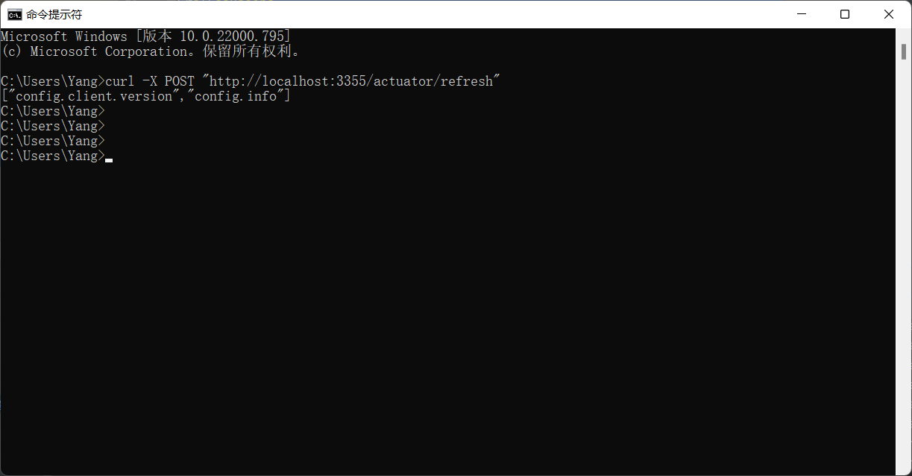

再次测试

[http://localhost:3355/configInfo](http://localhost:3355/configInfo "http://localhost:3355/configInfo")

3355改变没有??? **改了**。

想想还有什么问题?

*   假如有多个微服务客户端3355/3366/3377

*   每个微服务都要执行—次post请求，手动刷新?

*   可否广播，一次通知，处处生效?

*   我们想大范围的自动刷新，求方法

*   **做不到，引入Bus消息总线**

# 78.Bus消息总线是什么

**上—讲解的加深和扩充**

Spring Cloud Bus配合Spring Cloud Config使用可以实现配置的动态刷新。

**是什么**

它整合了Java的事件处理机制和消息中间件的功能。
Spring Clud Bus目前支持RabbitMQ和Kafka。


**基本原理**
ConfigClient实例都监听MQ中同一个topic(默认是springCloudBus)。当一个服务刷新数据的时候，它会把这个信息放入到Topic中，这样其它监听同一Topic的服务就能得到通知，然后去更新自身的配置。

# 79.Bus之RabbitMQ环境配置

安装rabbitmq，我的安装在虚拟机

# 80.Bus动态刷新全局广播的设计思想和选型

**1.新建cloud-config-client-3366**

同3355

**设计思想**

1）利用消息总线触发一个客户端/bus/refresh,而刷新所有客户端的配置

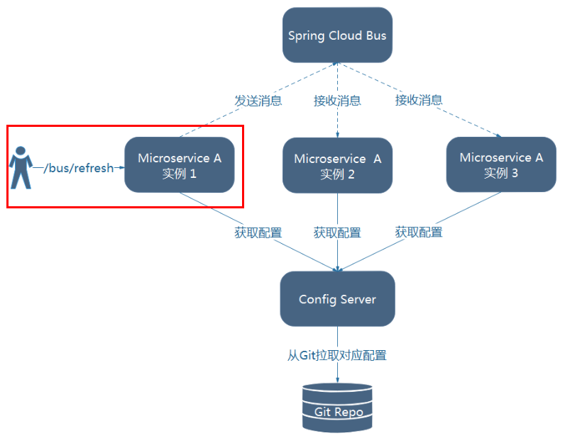

2）利用消息总线触发一个服务端ConfigServer的/bus/refresh端点，而刷新所有客户端的配置


图二更合适

# 81.Bus动态刷新全局广播配置实现

**给cloud-config-center-3344配置中心服务端添加消息总线支持**

**pom**

```xml
<!--添加消息总线RabbitMQ支持-->
<dependency>
    <groupId>org.springframework.cloud</groupId>
    <artifactId>spring-cloud-starter-bus-amqp</artifactId>
</dependency>
```

**yml**

```yaml
server:
  port: 3344

spring:
  application:
    name:  cloud-config-center #注册进Eureka服务器的微服务名
  cloud:
    config:
      server:
        git:
          uri: https://gitee.com/yang-xiao-bai/springcloud-config.git #GitHub上面的git仓库名字
          ####搜索目录
          search-paths:
            - springcloud-config
          username: gitee账号
          password: gitee密码
      ####读取分支
      label: master
  rabbitmq:
    host: 192.168.20.128
    port: 5672
    username: root
    password: root

#服务注册到eureka地址
eureka:
  client:
    service-url:
      defaultZone: http://localhost:7001/eureka

##rabbitmq相关配置,暴露bus刷新配置的端点
management:
  endpoints: #暴露bus刷新配置的端点
    web:
      exposure:
        include: 'bus-refresh'

```

**给cloud-config-client-3355客户端添加消息总线支持** 和 **给cloud-config-client-3366客户端添加消息总线支持**

**pom**

```xml
<!--添加消息总线RabbitMQ支持-->
<dependency>
    <groupId>org.springframework.cloud</groupId>
    <artifactId>spring-cloud-starter-bus-amqp</artifactId>
</dependency>
```

**yml**

```yaml
server:
  port: 3355

spring:
  application:
    name: config-client
  cloud:
    #Config客户端配置
    config:
      label: master #分支名称
      name: config #配置文件名称
      profile: dev #读取后缀名称   上述3个综合：master分支上config-dev.yml的配置文件被读取
      uri: http://localhost:3344 #配置中心地址k
#rabbitmq相关配置 15672是Web管理界面的端口；5672是MQ访问的端口
  rabbitmq:
    host: 192.168.20.128
    port: 5672
    username: root
    password: root

#服务注册到eureka地址
eureka:
  client:
    service-url:
      defaultZone: http://localhost:7001/eureka
# 暴露监控端点
management:
  endpoints:
    web:
      exposure:
        include: "*"   # 'refresh'

```

**测试**

修改Github上配置文件增加版本号


一次发送，处处生效

# 82.Bus动态刷新定点通知

不想全部通知，只想定点通知

*   只通知3355

*   不通知3366

简单一句话 - **指定具体某一个实例生效而不是全部**

*   请求连接：[http://localhost:3344/actuator/bus-refresh/{destination}](http://localhost:3344/actuator/bus-refresh/{destination} "http://localhost:3344/actuator/bus-refresh/{destination}")

*   /bus/refresh请求不再发送到具体的服务实例上，而是发给config server通过destination参数类指定需要更新配置的服务或实例


# 83.Stream为什么被引入

常见MQ(消息中间件)：

*   ActiveMQ

*   RabbitMQ

*   RocketMQ

*   Kafka

有没有一种新的技术诞生，让我们不再关注具体MQ的细节，我们只需要用一种适配绑定的方式，自动的给我们在各种MQ内切换。

# 84.Stream是什么及Binder介绍

[官方文档1](https://spring.io/projects/spring-cloud-stream#overview "官方文档1")

[官方文档2](https://cloud.spring.io/spring-tloud-static/spring-cloud-stream/3.0.1.RELEASE/reference/html/Spring "官方文档2")

[Cloud Stream中文指导手册](https://m.wang1314.com/doc/webapp/topic/20971999.html "Cloud Stream中文指导手册")

目前仅支持RabbitMQ、 Kafka。

Spring Cloud Stream为一些供应商的消息中间件产品提供了个性化的自动化配置实现，引用了**发布-订阅、消费组、分区**的三个核心概念。

# 85.Stream的设计思想


**为什么用Cloud Stream？**

解耦合

**通过定义绑定器Binder作为中间层，实现了应用程序与消息中间件细节之间的隔离**。

**Binder**：

*   INPUT对应于消费者

*   OUTPUT对应于生产者


**Stream中的消息通信方式遵循了发布-订阅模式**

Topic主题进行广播

*   在RabbitMQ就是Exchange

*   在Kakfa中就是Topic

# 86.Stream编码常用注解简介

**Spring Cloud Stream标准流程套路**


*   Binder - 很方便的连接中间件，屏蔽差异。

*   Channel - 通道，是队列Queue的一种抽象，在消息通讯系统中就是实现存储和转发的媒介，通过Channel对队列进行配置。

*   Source和Sink - 简单的可理解为参照对象是Spring Cloud Stream自身，从Stream发布消息就是输出，接受消息就是输入

| 组成              | 说明                                                                                                                              |
| --------------- | ------------------------------------------------------------------------------------------------------------------------------- |
| Middleware      | 中间件，目前只支持RabbitMQ和Kafka                                                                                                         |
| Binder          | inder是应用与消息中间件之间的封装，目前实行了Kafka和RabbitMQ的Binder，通过Binder可以很方便的连接中间件，可以动态的改变消息类型(对应于Kafka的topic,RabbitMQ的exchange)，这些都可以通过配置文件来实现 |
| @Input          | 注解标识输入通道，通过该输乎通道接收到的消息进入应用程序                                                                                                    |
| @Output         | 注解标识输出通道，发布的消息将通过该通道离开应用程序                                                                                                      |
| @StreamListener | 监听队列，用于消费者的队列的消息接收                                                                                                              |
| @EnableBinding  | 指信道channel和exchange绑定在一起                                                                                                        |

**案例说明**

工程中新建三个子模块

*   cloud-stream-rabbitmq-provider8801，作为生产者进行发消息模块

*   cloud-stream-rabbitmq-consumer8802，作为消息接收模块

*   cloud-stream-rabbitmq-consumer8803，作为消息接收模块

# 87.Stream消息驱动之生产者

**新建Module：cloud-stream-rabbitmq-provider8801**

```xml
<?xml version="1.0" encoding="UTF-8"?>
<project xmlns="http://maven.apache.org/POM/4.0.0"
         xmlns:xsi="http://www.w3.org/2001/XMLSchema-instance"
         xsi:schemaLocation="http://maven.apache.org/POM/4.0.0 http://maven.apache.org/xsd/maven-4.0.0.xsd">
    <parent>
        <artifactId>springcloud</artifactId>
        <groupId>com.yxz.springcloud</groupId>
        <version>1.0-SNAPSHOT</version>
    </parent>
    <modelVersion>4.0.0</modelVersion>

    <artifactId>cloud-stream-rabbitmq-provider8801</artifactId>
    <dependencies>
        <dependency>
            <groupId>org.springframework.boot</groupId>
            <artifactId>spring-boot-starter-web</artifactId>
        </dependency>
        <dependency>
            <groupId>org.springframework.boot</groupId>
            <artifactId>spring-boot-starter-actuator</artifactId>
        </dependency>
        <dependency>
            <groupId>org.springframework.cloud</groupId>
            <artifactId>spring-cloud-starter-netflix-eureka-client</artifactId>
        </dependency>
        <dependency>
            <groupId>org.springframework.cloud</groupId>
            <artifactId>spring-cloud-starter-stream-rabbit</artifactId>
        </dependency>
        <!--基础配置-->
        <dependency>
            <groupId>org.springframework.boot</groupId>
            <artifactId>spring-boot-devtools</artifactId>
            <scope>runtime</scope>
            <optional>true</optional>
        </dependency>
        <dependency>
            <groupId>org.projectlombok</groupId>
            <artifactId>lombok</artifactId>
            <optional>true</optional>
        </dependency>
        <dependency>
            <groupId>org.springframework.boot</groupId>
            <artifactId>spring-boot-starter-test</artifactId>
            <scope>test</scope>
        </dependency>
    </dependencies>

</project>
```

**yml**

```yaml
server:
  port: 8801
spring:
  application:
    name: cloud-stream-provider
  rabbitmq:
    host: 192.168.20.128
    port: 5672
    username: root
    password: root
  cloud:
    stream:
      binders: ## 在此处配置要绑定的rabbitmq的服务信息；
        defaultRabbit:  # 表示定义的名称，用于于binding整合
          type: rabbit
          environment:
            spring:
              rabbitmq:
                host: 192.168.20.128
                port: 5672
                username: root
                password: root
      bindings: # 服务的整合处理
        output: # 这个名字是一个通道的名称
          destination: studyExchange # 表示要使用的Exchange名称定义
          content-type: application/json # 设置消息类型，本次为json，文本则设置“text/plain”
          binder: defaultRabbit # 设置要绑定的消息服务的具体设置

eureka:
  client:  # 客户端进行Eureka注册的配置
    service-url:
      defaultZone: http://localhost:7001/eureka
  instance:
    lease-renewal-interval-in-seconds: 2 # 设置心跳的时间间隔（默认是30秒）
    lease-expiration-duration-in-seconds: 5 # 如果现在超过了5秒的间隔（默认是90秒）
    instance-id: send-8801.com # 在信息列表时显示主机名称
    prefer-ip-address: true # 访问的路径变为IP地址


```

如果报错拒绝连接，在spring下面添加这个，就好了

```yaml
  rabbitmq:
    host: 192.168.20.128
    port: 5672
    username: root
    password: root
```

**启动类**

**业务类**

service接口

```java
public interface IMessageProvider {
    public String send();
}
```

serviceImpl

```java
@EnableBinding(Source.class)  //定义消息的推送信道
public class MessageProviderImpl implements IMessageProvider {

    @Resource
    private MessageChannel output;

    @Override
    public String send() {
        String serial = UUID.randomUUID().toString();
        this.output.send(MessageBuilder.withPayload(serial).build());
        System.out.println("***serial: "+serial);
        return serial;
    }
}
```

controller

```java
@RestController
public class SendMessageController
{
    @Resource
    private IMessageProvider messageProvider;

    @GetMapping(value = "/sendMessage")
    public String sendMessage() {
        return messageProvider.send();
    }
}

```

**测试**

成功

# 88.Stream消息驱动之消费者

**建Module：cloud-stream-rabbitmq-consumer8802**

**pom同上**

**yml**，报错同上，加上一个配置就好了

```yaml
server:
  port: 8802

spring:
  application:
    name: cloud-stream-consumer
  rabbitmq:
    host: 192.168.20.128
    port: 5672
    username: root
    password: root
  cloud:
    stream:
      binders: # 在此处配置要绑定的rabbitmq的服务信息；
        defaultRabbit: # 表示定义的名称，用于于binding整合
          type: rabbit # 消息组件类型
          environment: # 设置rabbitmq的相关的环境配置
            spring:
              rabbitmq:
                host: 192.168.20.128
                port: 5672
                username: root
                password: root
      bindings: # 服务的整合处理
        input: # 这个名字是一个通道的名称
          destination: studyExchange # 表示要使用的Exchange名称定义
          content-type: application/json # 设置消息类型，本次为对象json，如果是文本则设置“text/plain”
          binder: defaultRabbit # 设置要绑定的消息服务的具体设置
#          group: yxz1
eureka:
  client: # 客户端进行Eureka注册的配置
    service-url:
      defaultZone: http://localhost:7001/eureka
  instance:
    lease-renewal-interval-in-seconds: 2 # 设置心跳的时间间隔（默认是30秒）
    lease-expiration-duration-in-seconds: 5 # 如果现在超过了5秒的间隔（默认是90秒）
    instance-id: receive-8802.com  # 在信息列表时显示主机名称
    prefer-ip-address: true     # 访问的路径变为IP地址
```

测试

*   启动EurekaMain7001

*   启动StreamMQMain8801

*   启动StreamMQMain8802

*   8801发送8802接收消息

# 89.Stream之消息重复消费

克隆出来一份运行8803 - cloud-stream-rabbitmq-consumer8803

**启动**

*   RabbitMQ

*   服务注册 - 8801

*   消息生产 - 8801

*   消息消费 - 8802

*   消息消费 - 8802

**运行后有两个问题**

1.  有重复消费问题

2.  消息持久化问题

消费

*   [http://localhost:8801/sendMessage](http://localhost:8801/sendMessage "http://localhost:8801/sendMessage")

*   目前是8802/8803同时都收到了，存在重复消费问题

*   分组和持久化

**生产实际案例**

订单系统我们做集群部署，都会从RabbitMQ中获取订单信息，那如果一个订单同时被两个服务获取到，那么就会造成数据错误，我们得避免这种情况。这时我们就可以**使用Stream中的消息分组来解决**。

同组内的属于竞争关系

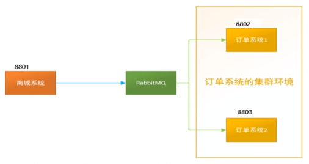

# 90.Stream之group解决消息重复消费

**原理**

微服务应用放置于同一个group中，就能够保证消息只会被其中一个应用消费一次。

**不同的组**是可以重复消费的，**同一个组**内会发生竞争关系，只有其中一个可以消费。

**8802/8803都变成不同组，group两个不同**

group: A\_Group、B\_Group

8802修改YML，group为yxz1

8803修改YML，group为yxz2

发现消息8002和8003都接收到了

**8802/8803都变成同组，group两个相同**

group: A\_Group

8802修改YML，group为yxz1

8803修改YML，group为yxz1

发现消息8002和8003轮流接到消息

# 91.Stream之消息持久化

一句话，配置了group的分组，实现了持久化，宕机重启后可以收到积压的消息

没配置group的不行

# 92.Sleuth是什么

**为什么会出现这个技术？要解决哪些问题？**

在微服务框架中，一个由客户端发起的请求在后端系统中会经过多个不同的的服务节点调用来协同产生最后的请求结果，每一个前段请求都会形成一条复杂的分布式服务调用链路，链路中的任何一环出现高延时或错误都会引起整个请求最后的失败。

**是什么**

*   [https://github.com/spring-cloud/spring-cloud-sleuth](https://github.com/spring-cloud/spring-cloud-sleuth "https://github.com/spring-cloud/spring-cloud-sleuth")

*   Spring Cloud Sleuth提供了一套完整的服务跟踪的解决方案

*   在分布式系统中提供追踪解决方案并且兼容支持了zipkin

一句话：可以监控每次调用从头到尾调用的接口和时间

# 93.Sleuth之zipkin搭建安装

**下载**新地址

*   [https://search.maven.org/remote\_content?g=io.zipkin.java\&a=zipkin-server\&v=LATEST\&c=exec](https://search.maven.org/remote_content?g=io.zipkin.java\&a=zipkin-server\&v=LATEST\&c=exec "https://search.maven.org/remote_content?g=io.zipkin.java\&a=zipkin-server\&v=LATEST\&c=exec")

*   zipkin-server-2.12.9-exec.jar

```bash
java -jar zipkin-server-2.12.9-exec.jar
```

**运行控制台**

[http://localhost:9411/zipkin/](http://localhost:9411/zipkin/ "http://localhost:9411/zipkin/")

# 94.Sleuth链路监控展现

1服务提供者

cloud-provider-payment8001

pom

```xml
<!--包含了sleuth+zipkin-->
<dependency>
    <groupId>org.springframework.cloud</groupId>
    <artifactId>spring-cloud-starter-zipkin</artifactId>
</dependency>
```

```yaml
spring:
  application:
    name: cloud-payment-service

  zipkin:
      base-url: http://localhost:9411
  sleuth:
    sampler:
    #采样率值介于 0 到 1 之间，1 则表示全部采集
    probability: 1
```

controller

```java
@GetMapping("/payment/zipkin")
    public String paymentZipkin() {
        return "hi ,i'am paymentzipkin server fall back，welcome to here, O(∩_∩)O哈哈~";
    }   
```

2服务消费者

cloud-provider-payment80

pom

```xml
<!--包含了sleuth+zipkin-->
<dependency>
    <groupId>org.springframework.cloud</groupId>
    <artifactId>spring-cloud-starter-zipkin</artifactId>
</dependency>
```

```yaml
spring:
  application:
    name: cloud-payment-service

  zipkin: 
      base-url: http://localhost:9411
  sleuth: 
    sampler:
    #采样率值介于 0 到 1 之间，1 则表示全部采集
    probability: 1
```

业务类OrderController

```java
 // ====================> zipkin+sleuth
    @GetMapping("/consumer/payment/zipkin")
    public String paymentZipkin()
    {
        String result = restTemplate.getForObject("http://localhost:8001"+"/payment/zipkin/", String.class);
        return result;
    }

```

4.依次启动eureka7001/8001/80 - 80调用8001几次测试下

5.打开浏览器访问: [http://localhost:9411](http://localhost:9411 "http://localhost:9411")


# SpringCloud学习笔记95-137

# 95.Cloud Alibaba简介

[官网](https://github.com/alibaba/spring-cloud-alibaba/blob/master/README-zh.md "官网")

```xml
<dependencyManagement>
    <dependencies>
        <dependency>
            <groupId>com.alibaba.cloud</groupId>
            <artifactId>spring-cloud-alibaba-dependencies</artifactId>
            <version>2.2.5.RELEASE</version>
            <type>pom</type>
            <scope>import</scope>
        </dependency>
    </dependencies>
</dependencyManagement>

```

*   中文

    *   [https://github.com/alibaba/spring-cloud-alibaba/blob/master/README-zh.md](https://github.com/alibaba/spring-cloud-alibaba/blob/master/README-zh.md "https://github.com/alibaba/spring-cloud-alibaba/blob/master/README-zh.md")

# 96.Nacos简介和下载

**Nacos = Eureka+Config+Bus**

去哪下

*   [https://github.com/alibaba/nacos/releases](https://github.com/alibaba/nacos/releases "https://github.com/alibaba/nacos/releases")

*   [官网文档](<https://spring-cloud-alibaba-group.github.io/github-pages/greenwich/spring-cloud-alibaba.html#_spring cloud alibaba nacos_discovery> "官网文档")

| 服务注册与发现框架 | CAP模型 | 控制台管理 | 社区活跃度      |
| --------- | ----- | ----- | ---------- |
| Eureka    | AP    | 支持    | 低(2.x版本闭源) |
| Zookeeper | CP    | 不支持   | 中          |
| consul    | CP    | 支持    | 高          |
| Nacos     | AP    | 支持    | 高          |

# 97.Nacos安装

*   从[官网](https://github.com/alibaba/nacos/releases "官网")下载Nacos

*   解压安装包，直接运行bin目录下的startup.cmd

*   命令运行成功后直接访问http\://localhost:8848/nacos，默认账号密码都是nacos

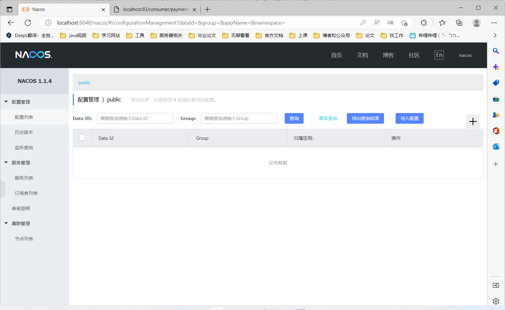

# 98.Nacos之服务提供者注册

**新建Module - cloudalibaba-provider-payment9001**

**POM**

```xml
<?xml version="1.0" encoding="UTF-8"?>
<project xmlns="http://maven.apache.org/POM/4.0.0"
         xmlns:xsi="http://www.w3.org/2001/XMLSchema-instance"
         xsi:schemaLocation="http://maven.apache.org/POM/4.0.0 http://maven.apache.org/xsd/maven-4.0.0.xsd">
    <parent>
        <artifactId>springcloud</artifactId>
        <groupId>com.yxz.springcloud</groupId>
        <version>1.0-SNAPSHOT</version>
    </parent>
    <modelVersion>4.0.0</modelVersion>

    <artifactId>cloudalibaba-provider-payment9001</artifactId>

    <!-- SpringBoot整合Web组件 -->
    <dependencies>
        <dependency>
            <groupId>com.alibaba.cloud</groupId>
            <artifactId>spring-cloud-starter-alibaba-nacos-discovery</artifactId>
        </dependency>
        <dependency>
            <groupId>org.springframework.boot</groupId>
            <artifactId>spring-boot-starter-web</artifactId>
        </dependency>
        <dependency>
            <groupId>org.springframework.boot</groupId>
            <artifactId>spring-boot-starter-actuator</artifactId>
        </dependency>
        <!--日常通用jar包配置-->
        <dependency>
            <groupId>org.springframework.boot</groupId>
            <artifactId>spring-boot-devtools</artifactId>
            <scope>runtime</scope>
            <optional>true</optional>
        </dependency>
        <dependency>
            <groupId>org.projectlombok</groupId>
            <artifactId>lombok</artifactId>
            <optional>true</optional>
        </dependency>
        <dependency>
            <groupId>org.springframework.boot</groupId>
            <artifactId>spring-boot-starter-test</artifactId>
            <scope>test</scope>
        </dependency>
    </dependencies>

</project>
```

**yml**

```yaml
server:
  port: 9001
spring:
  application:
    name: nacos-payment-provider
  cloud:
    nacos:
      discovery:
        server-addr: 127.0.0.1:8848
management:
  endpoints:
    web:
      exposure:
        include: '*'
```

**主启动**

```java
@SpringBootApplication
@EnableDiscoveryClient
public class PaymentMain9001 {
    public static void main(String[] args) {
        SpringApplication.run(PaymentMain9001.class, args);
    }
}
```

**业务类**

```java
@RestController
public class PaymentController {
    @Value("${server.port}")
    private String serverPort;

    @GetMapping("/payment/nacos/{id}")
    public String getPayment(@PathVariable("id") Integer id) {
        return "nacos registry, serverPort: "+ serverPort+"\t id"+id;
    }
}
```

测试

*   [http://localhost:9001/payment/nacos/1](http://localhost:9001/payment/nacos/1 "http://localhost:9001/payment/nacos/1")

# 99.Nacos之服务消费者注册和负载

**新建Module - cloudalibaba-consumer-nacos-order83**

**pom同上**

**yml**

```yaml
server:
  port: 83
spring:
  application:
    name: nacos-payment-consumer
  cloud:
    nacos:
      discovery:
        server-addr: 127.0.0.1:8848

#消费者将要去访问的微服务名称(注册成功进nacos的微服务提供者)
service-url:
  nacos-user-service: http://nacos-payment-provider
logging:
  level:
    com.yxz: debug
```

**主启动**

```java
@SpringBootApplication
@EnableDiscoveryClient
public class Consumer83 {
    public static void main(String[] args) {
        SpringApplication.run(Consumer83.class, args);
    }
}
```

**业务类**

config

```java
@Configuration
public class ApplicationContestConfig {
    @Bean
    @LoadBalanced
    public RestTemplate getRestTemplate(){
        return new RestTemplate();
    }
}
```

controller

```java
@RestController
public class ConsumerController {

    @Value("${service-url.nacos-user-service}")
    private String serverURL;
    @Autowired
    private RestTemplate restTemplate;

    @GetMapping("/consumer/payment/nacos/{id}")
    public String paymentInfo(@PathVariable("id") Long id) {
        return restTemplate.getForObject(serverURL + "/payment/nacos/" + id, String.class);
    }

}

```

测试

*   启动nacos控制台

*   [http://localhost:83/Eonsumer/payment/nacos/13](http://localhost:83/Eonsumer/payment/nacos/13 "http://localhost:83/Eonsumer/payment/nacos/13")

    *   83访问9001/9002，轮询负载OK

# 100.Nacos服务注册中心对比提升

**Nacos支持AP和CP模式的切换**

切换命令：

`curl -X PUT '$NACOS_SERVER:8848/nacos/v1/ns/operator/switches?entry=serverMode&value=CP`

# 101.Nacos之服务配置中心

基础配置

**建cloudalibaba-config-nacos-client3377**

**pom**

```xml
<?xml version="1.0" encoding="UTF-8"?>
<project xmlns="http://maven.apache.org/POM/4.0.0"
         xmlns:xsi="http://www.w3.org/2001/XMLSchema-instance"
         xsi:schemaLocation="http://maven.apache.org/POM/4.0.0 http://maven.apache.org/xsd/maven-4.0.0.xsd">
    <parent>
        <artifactId>springcloud</artifactId>
        <groupId>com.yxz.springcloud</groupId>
        <version>1.0-SNAPSHOT</version>
    </parent>
    <modelVersion>4.0.0</modelVersion>

    <artifactId>cloudalibaba-config-nacos-client3377</artifactId>

    <dependencies>
        <dependency>
            <groupId>com.alibaba.cloud</groupId>
            <artifactId>spring-cloud-starter-alibaba-nacos-config</artifactId>
        </dependency>
        <dependency>
            <groupId>com.alibaba.cloud</groupId>
            <artifactId>spring-cloud-starter-alibaba-nacos-discovery</artifactId>
        </dependency>
        <dependency>
            <groupId>org.springframework.boot</groupId>
            <artifactId>spring-boot-starter-web</artifactId>
        </dependency>
        <dependency>
            <groupId>org.springframework.boot</groupId>
            <artifactId>spring-boot-starter-actuator</artifactId>
        </dependency>
        <!--日常通用jar包配置-->
        <dependency>
            <groupId>org.springframework.boot</groupId>
            <artifactId>spring-boot-devtools</artifactId>
            <scope>runtime</scope>
            <optional>true</optional>
        </dependency>
        <dependency>
            <groupId>org.projectlombok</groupId>
            <artifactId>lombok</artifactId>
            <optional>true</optional>
        </dependency>
        <dependency>
            <groupId>org.springframework.boot</groupId>
            <artifactId>spring-boot-starter-test</artifactId>
            <scope>test</scope>
        </dependency>
    </dependencies>
</project>
```

**yml**

boostrap.yml

```yaml
# nacos配置
server:
  port: 3377

spring:
  application:
    name: nacos-config-client
  cloud:
    nacos:
      discovery:
        server-addr: localhost:8848 #Nacos服务注册中心地址
      config:
        server-addr: localhost:8848 #Nacos作为配置中心地址
        file-extension: yaml #指定yaml格式的配置
        group: DEV_GROUP
        namespace: 93958db7-1b87-45e6-aee2-03ac1423fe76
```

application.yml

```yaml
spring:
  profiles:
    active: dev # 表示开发环境

```

**主启动**

```java
@EnableDiscoveryClient
@SpringBootApplication
public class NacosConfigClientMain3377 {
    public static void main(String[] args) {
        SpringApplication.run(NacosConfigClientMain3377.class, args);
    }
}
```

**业务类**

```java
@RestController
@RefreshScope //在控制器类加入@RefreshScope注解使当前类下的配置支持Nacos的动态刷新功能。
public class ConfigClientController
{
    @Value("${config.info}")
    private String configInfo;

    @GetMapping("/config/info")
    public String getConfigInfo() {
        return configInfo;
    }
}
```

在 Nacos Spring Cloud中,dataId的完整格式如下：

\${prefix}-{spring-profile.active}.\${file-extension}

# 102.Nacos之命名空间分组和DataID三者关系

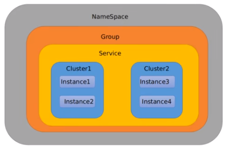

namespace→group→profile.active

等效于：学校→学院→班级

中间几章没什么好说的

# 106.Nacos集群\_架构说明

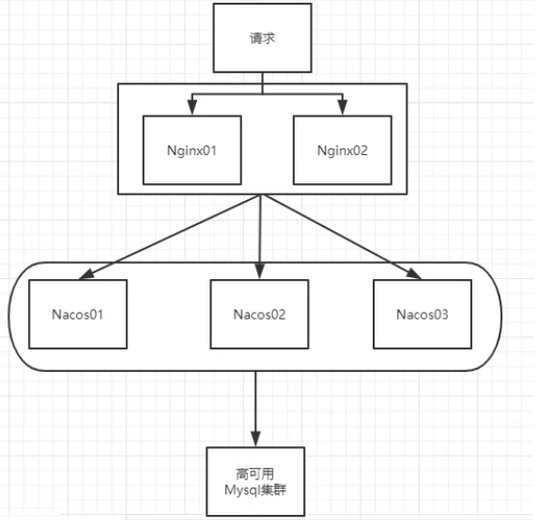

按照上述，**我们需要mysql数据库**。

[官网说明](https://nacos.io/zh-cn/docs/deployment.html "官网说明")

默认Nacos使用嵌入式数据库实现数据的存储。所以，如果启动多个默认配置下的Nacos节点，数据存储是存在一致性问题的。为了解决这个问题，**Nacos采用了集中式存储的方式来支持集群化部署，目前只支持MySQL的存储**。

# 107.Nacos持久化切换配置

1.  安装数据库，版本要求:5.6.5+

2.  初始化mysq数据库，数据库初始化文件: nacos-mysql.sql

3.  修改conf/application.properties文件，增加支持mysql数据源配置（目前只支持mysql)，添加mysql数据源的url、用户名和密码。

```.properties
spring.datasource.platform=mysql

db.num=1
db.url.0=jdbc:mysql://11.162.196.16:3306/nacos_devtest?severTimezone=UTC&characterEncoding=utf8&connectTimeout=1000&socketTimeout=3000&autoReconnect=true
db.user=nacos_devtest
db.password=youdontknow

```

mysql8的坑

1.  要加时区

2.  要安装对应jar包，放在plugins/mysql下

如果还是报错，请按照以下方式

```yaml
#对于107使用mysql8的朋友，可以把nacos换为从1.3.1版本，（我试过1.4.0也报错）
#同时在conf下的application.properties中加入老师的配置再加上
#&serverTimezone=UTC，最后在bin目录下cmd，
#然后输入startup.cmd -m standalone，然后就行了
```

这里版本我踩了坑，最后选择了1.3.1，其他尝试加了jar包也不行

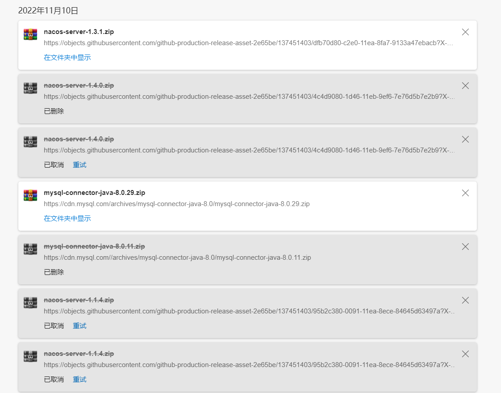

# 108.Nacos之Linux版本安装

预计需要，1个Nginx+3个nacos注册中心+1个mysql

内存给大一点，2个g的虚拟机跑的有点卡，建议3个g，并且设置nacos的内存大小为512m，可以流畅运行

下载的也是1.3.1版本

# 109.Nacos集群配置(上)

**1.进入mysql，创建数据库**

```bash
create database nacos_config;
use nacos_config;
source /opt/software/nacos/config/nacos-mysql.sql
```

**2.application.properties配置**

同window，见107章

**3.Linux服务器上nacos的集群配置cluster.conf**

```bash
192.168.20.128:3333
192.168.20.128:4444
192.168.20.128:5555
```

**4.编辑Nacos的启动脚本startup.sh，使它能够接受不同的启动端口**

照着老师的抄

执行三次startup.sh - p 端口号

# 110.Nacos集群配置(下)

**5.Nginx的配置，由它作为负载均衡器**

修改nginx的配置文件 - nginx.conf

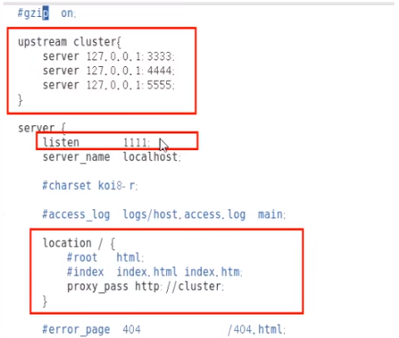

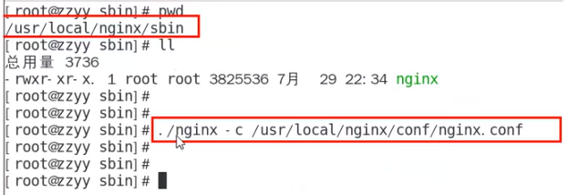

**测试**

*   启动3个nacos注册中心

    *   `startup.sh - p 3333`

    *   `startup.sh - p 4444`

    *   `startup.sh - p 5555`

    *   查看nacos进程启动数`ps -ef | grep nacos | grep -v grep | wc -l`

*   启动nginx

    *   `./nginx -c /usr/local/nginx/conf/nginx.conf`

    *   查看nginx进程`ps - ef| grep nginx`

*   测试通过nginx，访问nacos - [http://192.168.111.144:1111/nacos/#/login](http://192.168.111.144:1111/nacos/#/login "http://192.168.111.144:1111/nacos/#/login")

*   新建一个配置测试

*   查看数据库，有新家的信息

# 111.Sentinel是什么

[官方Github](https://github.com/alibaba/Sentinel "官方Github")

[官方文档](https://sentinelguard.io/zh-cn/docs/introduction.html "官方文档")

Hystrix与Sentinel比较：

*   Hystrix

    1.  需要我们程序员自己手工搭建监控平台

    2.  没有一套web界面可以给我们进行更加细粒度化得配置流控、速率控制、服务熔断、服务降级

*   Sentinel

    1.  单独一个组件，可以独立出来。

    2.  直接界面化的细粒度统一配置。

# 112.Sentinel下载安装运行

*   下载

    *   [https://github.com/alibaba/Sentinel/releases](https://github.com/alibaba/Sentinel/releases "https://github.com/alibaba/Sentinel/releases")

    *   下载到本地sentinel-dashboard-1.7.0.jar

运行

*   前提

    *   Java 8 环境

    *   8080端口不能被占用

*   访问Sentinel管理界面

    *   localhost:8080

    *   登录账号密码均为sentinel

# 113.Sentinel初始化监控

**启动Nacos8848成功**

**新建工程 - cloudalibaba-sentinel-service8401**

```xml
<!--SpringCloud ailibaba sentinel -->
<dependency>
    <groupId>com.alibaba.cloud</groupId>
    <artifactId>spring-cloud-starter-alibaba-sentinel</artifactId>
</dependency>
```

**YML**

```yaml
spring:
  application:
    name: cloudalibaba-sentinel-service
  cloud:
    nacos:
      discovery:
        server-addr: localhost:8848 #Nacos服务注册中心地址
    sentinel:
      transport:
        dashboard: localhost:8080 #配置Sentinel dashboard地址
        port: 8719
```

**controller**

```java
@RestController
@Slf4j
public class FlowLimitController {
    @GetMapping("/testA")
    public String testA()
    {
        return "------testA";
    }

    @GetMapping("/testB")
    public String testB()
    {
        return "------testB";
    }
    @GetMapping("/testD")
    public String testD()
    {
        //暂停几秒钟线程
        try { TimeUnit.SECONDS.sleep(1); } catch (InterruptedException e) { e.printStackTrace(); }
        log.info("testD 测试RT");
        return "------testD";
    }
    @GetMapping("/testE")
    public String testE()
    {
        log.info("testE 测试异常数");
        int age = 10/0;
        return "------testE 测试异常数";
    }


    @GetMapping("/testHotKey")
    @SentinelResource(value = "testHotKey",blockHandler = "deal_testHotKey" /*兜底方法*/)
    public String testHotKey(@RequestParam(value = "p1",required = false) String p1,
                             @RequestParam(value = "p2",required = false) String p2) {
        //int age = 10/0;
        return "------testHotKey";
    }

    /*兜底方法*/
    public String deal_testHotKey (String p1, String p2, BlockException exception) {
        return "------deal_testHotKey,o(╥﹏╥)o";
        //sentinel系统默认的提示：Blocked by Sentinel (flow limiting)
    }
}
```

启动后访问异常接口，可以在sentienl控制台看到

# 114-119.Sentinel流控规则简介

未来几章都是介绍这个，不难，直接一章总结完

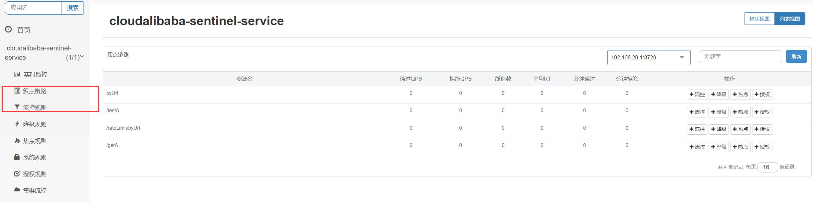

可以针对每个接口或者controller配置的value 值设置拦截规则

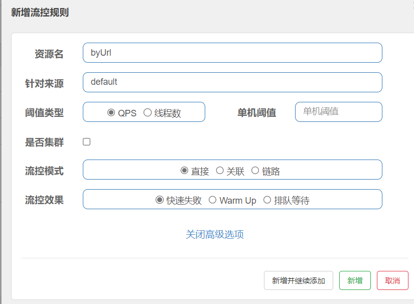

资源名就是id，阈值类型，QPS是单机的访问数，只允许一个访问，单机阈值的单位是s

线程数，是controller只允许设置的x个线程进入系统

快速失败：直接返回fallback的结果

warmup：冷启动，阈值从设置阈的1/3开始慢慢上升

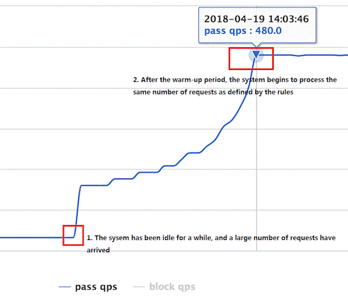

排队等待：在设置的时间内，会排队等待处理结果

关联：设置资源名A关联B，当B出现问题是A被限流。使用场景，支付场景高压时，下单场景限流

链路：符合条件时，从链路开始和结尾都限流

# 120-123.Sentinel降级简介

[官方文档](https://github.com/alibaba/Sentinel/wiki/熔断降级 "官方文档")

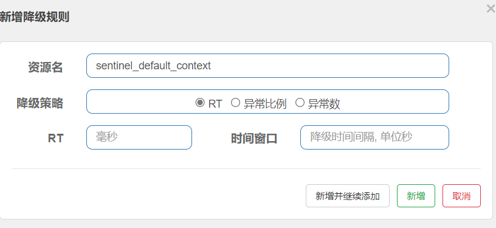

*   RT（平均响应时间，秒级）

    *   平均响应时间 超出阈值 且 在时间窗口内通过的请求>=5，两个条件同时满足后触发降级。

    *   窗口期过后关闭断路器。

    *   RT最大4900（更大的需要通过-Dcsp.sentinel.statistic.max.rt=XXXX才能生效）。

*   异常比列（秒级）

    *   QPS >= 5且异常比例（秒级统计）超过阈值时，触发降级;时间窗口结束后，关闭降级 。

*   异常数(分钟级)

    *   异常数(分钟统计）超过阈值时，触发降级;时间窗口结束后，关闭降级

对比限流和降级

*   限流：只要超过设定阈值，直接不让进入controller的方法

*   降级：能进入controller的情况下，发生错误，并达到设定阈值，服务降级

# 124-125.Sentinel热点key


对某个请求，携带某个请求值的时候，进行限流。

# 127-136.SentinelResource配置

自定义限流处理类 - 创建CustomerBlockHandler类用于自定义限流处理逻辑

```java
    @GetMapping("/rateLimit/customerBlockHandler")
    @SentinelResource(value = "customerBlockHandler",
            blockHandlerClass = CustomerBlockHandler.class,//<-------- 自定义限流处理类
            blockHandler = "handlerException2",
            fallback = "handlerFallback")//<-----------
    public CommonResult customerBlockHandler()
    {
        return new CommonResult(200,"按客戶自定义",new Payment(2020L,"serial003"));
    }
```

主要介绍了注解的用法

value就算id

blockHander是出现服务限流的调用返回方法

blockHanderClass是blockHander方法所在类，默认在本类

fallback是出现服务降级去找的方法，java异常去找他

出现java异常去找fallback，流控异常找blockhander，同时异常 找blockhander

# 137.Sentinel持久化规则

手动配置到nacos，nacos实现持久化，启服务后自己去nacos找

# 138.分布式事务问题由来

一句话：**一次业务操作需要跨多个数据源或需要跨多个系统进行远程调用，就会产生分布式事务问题。**

# 139.Seata术语

Seata是一款开源的分布式事务解决方案，致力于在微服务架构下提供高性能和简单易用的分布式事务服务。

[官方网址](http://seata.io/zh-cn/ "官方网址")

分布式事务处理过程的一ID+三组件模型：

*   Transaction ID XID 全局唯一的事务ID

*   三组件概念

    *   TC (Transaction Coordinator) - 事务协调者：维护全局和分支事务的状态，驱动全局事务提交或回滚。

    *   TM (Transaction Manager) - 事务管理器：定义全局事务的范围：开始全局事务、提交或回滚全局事务。

    *   RM (Resource Manager) - 资源管理器：管理分支事务处理的资源，与TC交谈以注册分支事务和报告分支事务的状态，并驱动分支事务提交或回滚。

处理过程：

1.  TM向TC申请开启一个全局事务，全局事务创建成功并生成一个全局唯一的XID；

2.  XID在微服务调用链路的上下文中传播；

3.  RM向TC注册分支事务，将其纳入XID对应全局事务的管辖；

4.  TM向TC发起针对XID的全局提交或回滚决议；

5.  TC调度XID下管辖的全部分支事务完成提交或回滚请求。

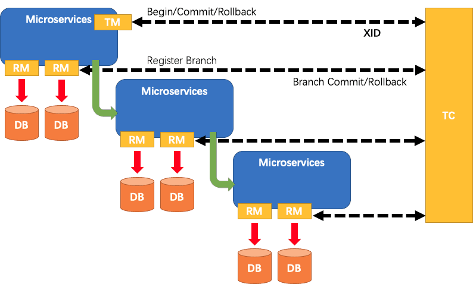

# 140.Seata-Server安装

**去哪下**

发布说明: [https://github.com/seata/seata/releases](https://github.com/seata/seata/releases "https://github.com/seata/seata/releases")

**怎么玩**

本地@Transactional （spring时候）

全局@GlobalTransactional （分布式时候）

**Seata-Server安装**

官网地址 - [http://seata.io/zh-cn/](http://seata.io/zh-cn/ "http://seata.io/zh-cn/")

seata-server-0.9.0.zip解压到指定目录并修改conf目录下的file.conf配置文件

主要修改:自定义事务组名称+事务日志存储模式为db +数据库连接信息

```yaml
service {
    ##fsp_tx_group是自定义的
    vgroup_mapping.my.test.tx_group="fsp_tx_group" 
    default.grouplist = "127.0.0.1:8091"
    enableDegrade = false
    disable = false
    max.commitretry.timeout= "-1"
    max.ollbackretry.timeout= "-1"
}

```

store模块

```yaml
store {
  ## store mode: file、db
  mode = "db"

  ## file store
  file {
    dir = "sessionStore"

    # branch session size , if exceeded first try compress lockkey, still exceeded throws exceptions
    max-branch-session-size = 16384
    # globe session size , if exceeded throws exceptions
    max-global-session-size = 512
    # file buffer size , if exceeded allocate new buffer
    file-write-buffer-cache-size = 16384
    # when recover batch read size
    session.reload.read_size = 100
    # async, sync
    flush-disk-mode = async
  }

  ## database store
  db {
    ## the implement of javax.sql.DataSource, such as DruidDataSource(druid)/BasicDataSource(dbcp) etc.
    datasource = "dbcp"
    ## mysql/oracle/h2/oceanbase etc.
    db-type = "mysql"
    driver-class-name = "com.mysql.cj.jdbc.Driver"
    url = "jdbc:mysql://127.0.0.1:3306/seata?serverTimezone=Asia/Shanghai&useUnicode=true&characterEncoding=utf-8&useSSL=false"
    user = "root"
    password = "root"
    min-conn = 1
    max-conn = 3
    global.table = "global_table"
    branch.table = "branch_table"
    lock-table = "lock_table"
    query-limit = 100
  }
}
```

mysql数据库新建库seata，在seata库里建表

修改seata-server-0.9.0\seata\conf目录下的registry.conf配置文件

```yaml
registry {
  # file 、nacos 、eureka、redis、zk、consul、etcd3、sofa
  type = "nacos"

  nacos {
    serverAddr = "localhost:8848"
    namespace = ""
    cluster = "default"
  }
}
```

目的是：指明注册中心为nacos，及修改nacos连接信息

先启动Nacos端口号8848 nacos\bin\startup.cmd

再启动seata-server - seata-server-0.9.0\seata\bin\seata-server.bat

# 141.Seata业务数据库准备

**一言蔽之**，下订单—>扣库存—>减账户(余额)。

创建业务数据库

*   seata\_ order：存储订单的数据库;

*   seata\_ storage：存储库存的数据库;

*   seata\_ account：存储账户信息的数据库。

按照上述3库分别建对应业务表

```sql
CREATE TABLE t_order (
    `id` BIGINT(11) NOT NULL AUTO_INCREMENT PRIMARY KEY,
    `user_id` BIGINT(11) DEFAULT NULL COMMENT '用户id',
    `product_id` BIGINT(11) DEFAULT NULL COMMENT '产品id',
    `count` INT(11) DEFAULT NULL COMMENT '数量',
    `money` DECIMAL(11,0) DEFAULT NULL COMMENT '金额',
    `status` INT(1) DEFAULT NULL COMMENT '订单状态: 0:创建中; 1:已完结'
) ENGINE=INNODB AUTO_INCREMENT=1 DEFAULT CHARSET=utf8;

SELECT * FROM t_order;

CREATE TABLE t_storage (
`id` BIGINT(11) NOT NULL AUTO_INCREMENT PRIMARY KEY,
`product_id` BIGINT(11) DEFAULT NULL COMMENT '产品id',
`total` INT(11) DEFAULT NULL COMMENT '总库存',
`used` INT(11) DEFAULT NULL COMMENT '已用库存',
`residue` INT(11) DEFAULT NULL COMMENT '剩余库存'
) ENGINE=INNODB AUTO_INCREMENT=1 DEFAULT CHARSET=utf8;

INSERT INTO seata_storage.t_storage(`id`, `product_id`, `total`, `used`, `residue`)
VALUES ('1', '1', '100', '0','100');

SELECT * FROM t_storage;

CREATE TABLE t_account(
  `id` BIGINT(11) NOT NULL AUTO_INCREMENT PRIMARY KEY COMMENT 'id',
  `user_id` BIGINT(11) DEFAULT NULL COMMENT '用户id',
  `total` DECIMAL(10,0) DEFAULT NULL COMMENT '总额度',
  `used` DECIMAL(10,0) DEFAULT NULL COMMENT '已用余额',
  `residue` DECIMAL(10,0) DEFAULT '0' COMMENT '剩余可用额度'
) ENGINE=INNODB AUTO_INCREMENT=1 DEFAULT CHARSET=utf8;

INSERT INTO seata_account.t_account(`id`, `user_id`, `total`, `used`, `residue`)
VALUES ('1', '1', '1000', '0', '1000');

SELECT * FROM t_account;

```

*   订单-库存-账户3个库下**都需要建各自的回滚日志表**

```sql
-- the table to store seata xid data
-- 0.7.0+ add context
-- you must to init this sql for you business databese. the seata server not need it.
-- 此脚本必须初始化在你当前的业务数据库中，用于AT 模式XID记录。与server端无关（注：业务数据库）
-- 注意此处0.3.0+ 增加唯一索引 ux_undo_log
drop table `undo_log`;
CREATE TABLE `undo_log` (
  `id` bigint(20) NOT NULL AUTO_INCREMENT,
  `branch_id` bigint(20) NOT NULL,
  `xid` varchar(100) NOT NULL,
  `context` varchar(128) NOT NULL,
  `rollback_info` longblob NOT NULL,
  `log_status` int(11) NOT NULL,
  `log_created` datetime NOT NULL,
  `log_modified` datetime NOT NULL,
  `ext` varchar(100) DEFAULT NULL,
  PRIMARY KEY (`id`),
  UNIQUE KEY `ux_undo_log` (`xid`,`branch_id`)
) ENGINE=InnoDB AUTO_INCREMENT=1 DEFAULT CHARSET=utf8;

```

# 142-146.Seata之Order-Module配置搭建

seata-order-service2001

seata-storage-service2002

seata-account-service2003

# 147.Seata之@GlobalTransactional验证

正常测试，可以下单

如果出现错误，或者超时，没有归滚

加上 **@GlobalTransactional**

```java
@GlobalTransactional(name = "fsp-create-order",rollbackFor = Exception.class)
    public void create(Order order)
    {
    ...
    }
```

还是模拟AccountServiceImpl添加超时，下单后数据库数据并没有任何改变，记录都添加不进来，**达到出异常，数据库回滚的效果**。

# 148.Seata之原理简介

TC：seata服务器

TM：标记了 **@GlobalTransactional** 事务发起方

RM：事务的参与方

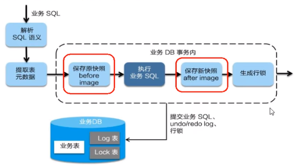

*   一阶段加载

在一阶段，Seata会拦截“业务SQL”

1.  解析SQL语义，找到“业务SQL" 要更新的业务数据，在业务数据被更新前，将其保存成"before image”

2.  执行“业务SQL" 更新业务数据，在业务数据更新之后,

3.  其保存成"after image”，最后生成行锁。

以上操作全部在一个数据库事务内完成, 这样保证了一阶段操作的原子性

*   二阶段提交

二阶段如果顺利提交的话，因为"业务SQL"在一阶段已经提交至数据库，所以Seata框架只需将一阶段保存的快照数据和行锁删掉，完成数据清理即可。

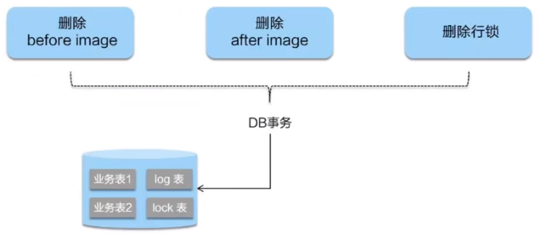

*   二阶段回滚

二阶段如果是回滚的话，Seata 就需要回滚一阶段已经执行的 “业务SQL"，还原业务数据。

回滚方式便是用"before image"还原业务数据；但在还原前要首先要校验脏写，对比“数据库当前业务数据”和"after image"。

如果两份数据完全一致就说明没有脏写， 可以还原业务数据，如果不一致就说明有脏写, 出现脏写就需要转人工处理。

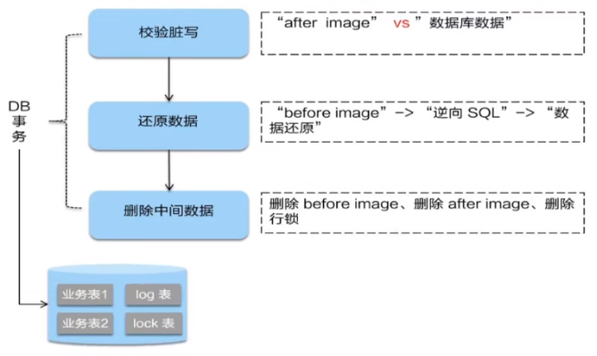

# Spring Cloud组件总结

| 组件        | 分类               | 简介 | 官网 | 笔记 |
| --------- | ---------------- | -- | -- | -- |
| Eureka    | 服务注册中心           |    |    |    |
| Zookeeper | 服务注册中心           |    |    |    |
| Consul    | 服务注册中心           |    |    |    |
| Ribbon    | 服务调用             |    |    |    |
| OpenFeign | 服务调用             |    |    |    |
| Hystrix   | 服务降级             |    |    |    |
| GateWay   | 服务网关             |    |    |    |
| Config    | 服务配置             |    |    |    |
| Bus       | 服务总线             |    |    |    |
| Stream    | 消息队列             |    |    |    |
| Sleuth    | 服务跟踪             |    |    |    |
| Nacos     | 服务注册中心、服务配置、服务总线 |    |    |    |
| Sentinel  | 服务降级             |    |    |    |
| Seata     | 分布式事务            |    |    |    |


